# Лабораторная №2

## Underlay. OSPF

### Цель задания

Настроить OSPF для Underlay сети.

### Задачи

1. Настроите OSPF в Underlay сети, для IP связанности между всеми сетевыми устройствами.
2. Зафиксируете в документации - план работы, адресное пространство, схему сети, конфигурацию устройств
3. Убедитесь в наличии IP связанности между устройствами в OSFP домене

### Топология сети

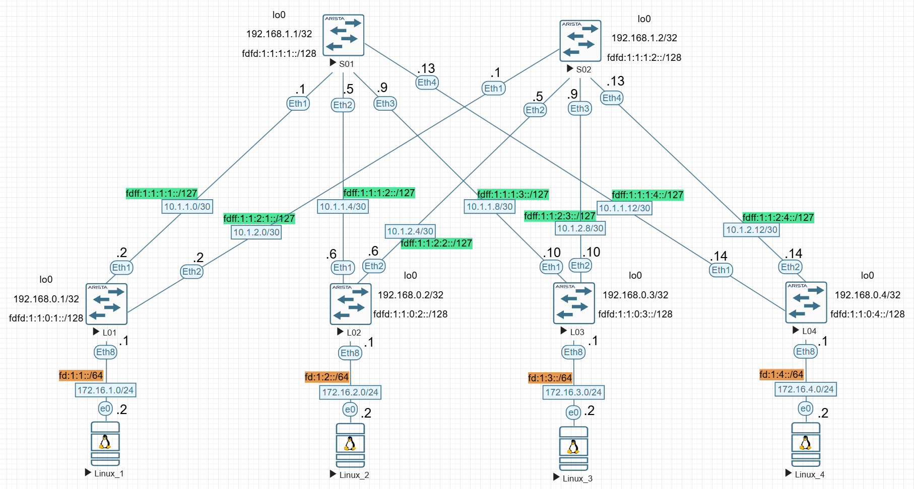

### Схема адресов IPv4 & IPv6

План адресации прведен в [лабораторной работе №1](../lab_01/README.md)

### Настройка OSPf на Spine

> **Примечание** - В ходе лабораторной работы выявлено: при использовании протокола OSPFv3 соседство в адресном семействе IPv4 устанавливается лишь при наличии соседства в IPv6; кроме того, для IPv4 не формируется BFD‑соседство. (верно для образа ARISTA EOS-4.32.4M) В связи с этим был отдельно настроен протокол OSPF для адресного семейства IPv4 и OSPFv3 для IPv6.

---

<details>

<summary>S01</summary>

```
interface Ethernet1
   description to_L01
   no switchport
   ip address 10.1.1.1/30
   ipv6 enable
   ipv6 address fdff:1:1:1:1::/127
   ip ospf neighbor bfd
   ip ospf network point-to-point
   ip ospf area 0.0.0.0
   ospfv3 ipv6 bfd
   no ospfv3 ipv6 passive-interface
   ospfv3 ipv6 network point-to-point
   ospfv3 ipv6 area 0.0.0.0
!
interface Ethernet2
   description to_L02
   no switchport
   ip address 10.1.1.5/30
   ipv6 enable
   ipv6 address fdff:1:1:1:2::/127
   ip ospf neighbor bfd
   ip ospf network point-to-point
   ip ospf area 0.0.0.0
   ospfv3 ipv6 bfd
   no ospfv3 ipv6 passive-interface
   ospfv3 ipv6 network point-to-point
   ospfv3 ipv6 area 0.0.0.0
!
interface Ethernet3
   description to_L03
   no switchport
   ip address 10.1.1.9/30
   ipv6 enable
   ipv6 address fdff:1:1:1:3::/127
   ip ospf neighbor bfd
   ip ospf network point-to-point
   ip ospf area 0.0.0.0
   ospfv3 ipv6 bfd
   no ospfv3 ipv6 passive-interface
   ospfv3 ipv6 network point-to-point
   ospfv3 ipv6 area 0.0.0.0
!
interface Ethernet4
   description to_L04
   no switchport
   ip address 10.1.1.13/30
   ipv6 enable
   ipv6 address fdff:1:1:1:4::/127
   ip ospf neighbor bfd
   ip ospf network point-to-point
   ip ospf area 0.0.0.0
   ospfv3 ipv6 bfd
   no ospfv3 ipv6 passive-interface
   ospfv3 ipv6 network point-to-point
   ospfv3 ipv6 area 0.0.0.0
!
interface Loopback0
   ip address 192.168.1.1/32
   ipv6 enable
   ipv6 address fdfd:1:1:1:1::/128
   ip ospf area 0.0.0.0
   ospfv3 ipv6 area 0.0.0.0
!
!
router ospf 1
   router-id 192.168.1.1
   bfd default
   passive-interface default
   no passive-interface Ethernet1
   no passive-interface Ethernet2
   no passive-interface Ethernet3
   no passive-interface Ethernet4
   max-lsa 12000
!
router ospfv3
   router-id 192.168.1.1
   !
   address-family ipv6
      bfd default
      passive-interface default
!
```

</details>

<details>

<summary>S02</summary>

```
!
interface Ethernet1
   description to_L01
   no switchport
   ip address 10.1.2.1/30
   ipv6 enable
   ipv6 address fdff:1:1:2:1::/127
   ip ospf neighbor bfd
   ip ospf network point-to-point
   ip ospf area 0.0.0.0
   ospfv3 ipv6 bfd
   no ospfv3 ipv6 passive-interface
   ospfv3 ipv6 network point-to-point
   ospfv3 ipv6 area 0.0.0.0
!
interface Ethernet2
   description to_L02
   no switchport
   ip address 10.1.2.5/30
   ipv6 enable
   ipv6 address fdff:1:1:2:2::/127
   ip ospf neighbor bfd
   ip ospf network point-to-point
   ip ospf area 0.0.0.0
   ospfv3 ipv6 bfd
   no ospfv3 ipv6 passive-interface
   ospfv3 ipv6 network point-to-point
   ospfv3 ipv6 area 0.0.0.0
!
interface Ethernet3
   description to_L03
   no switchport
   ip address 10.1.2.9/30
   ipv6 enable
   ipv6 address fdff:1:1:2:3::/127
   ip ospf neighbor bfd
   ip ospf network point-to-point
   ip ospf area 0.0.0.0
   ospfv3 ipv6 bfd
   no ospfv3 ipv6 passive-interface
   ospfv3 ipv6 network point-to-point
   ospfv3 ipv6 area 0.0.0.0
!
interface Ethernet4
   description to_L04
   no switchport
   ip address 10.1.2.13/30
   ipv6 enable
   ipv6 address fdff:1:1:2:4::/127
   ip ospf neighbor bfd
   ip ospf network point-to-point
   ip ospf area 0.0.0.0
   ospfv3 ipv6 bfd
   no ospfv3 ipv6 passive-interface
   ospfv3 ipv6 network point-to-point
   ospfv3 ipv6 area 0.0.0.0
!
!
interface Loopback0
   ip address 192.168.1.2/32
   ipv6 enable
   ipv6 address fdfd:1:1:1:2::/128
   ip ospf area 0.0.0.0
   ospfv3 ipv6 area 0.0.0.0
!
!
router ospf 1
   router-id 192.168.1.2
   bfd default
   passive-interface default
   no passive-interface Ethernet1
   no passive-interface Ethernet2
   no passive-interface Ethernet3
   no passive-interface Ethernet4
   max-lsa 12000
!
router ospfv3
   router-id 192.168.1.2
   !
   address-family ipv6
      bfd default
      passive-interface default
!
```

</details>

### Настройка OSPf на Leaf

---

<details>

<summary>L01</summary>

```
interface Ethernet1
   description to_S01
   no switchport
   ip address 10.1.1.2/30
   ipv6 enable
   ipv6 address fdff:1:1:1:1::1/127
   ip ospf neighbor bfd
   ip ospf network point-to-point
   ip ospf area 0.0.0.0
   ospfv3 ipv6 bfd
   no ospfv3 ipv6 passive-interface
   ospfv3 ipv6 network point-to-point
   ospfv3 ipv6 area 0.0.0.0
!
interface Ethernet2
   description to_S02
   no switchport
   ip address 10.1.2.2/30
   ipv6 enable
   ipv6 address fdff:1:1:2:1::1/127
   ip ospf neighbor bfd
   ip ospf network point-to-point
   ip ospf area 0.0.0.0
   ospfv3 ipv6 bfd
   no ospfv3 ipv6 passive-interface
   ospfv3 ipv6 network point-to-point
   ospfv3 ipv6 area 0.0.0.0
!
interface Ethernet8
   no switchport
   ip address 172.16.1.1/24
   ipv6 enable
   ipv6 address fd:1:1::1/64
   ip ospf area 0.0.0.0
   ospfv3 ipv6 area 0.0.0.0
!
interface Loopback0
   ip address 192.168.0.1/32
   ipv6 enable
   ipv6 address fdfd:1:1:0:1::/128
   ip ospf area 0.0.0.0
   ospfv3 ipv6 area 0.0.0.0
!
router ospf 1
   router-id 192.168.0.1
   bfd default
   passive-interface default
   no passive-interface Ethernet1
   no passive-interface Ethernet2
   max-lsa 12000
!
router ospfv3
   router-id 192.168.0.1
   !
   address-family ipv6
      bfd default
      passive-interface default
!
```

</details>

<details>

<summary>L02</summary>

```
interface Ethernet1
   description to_S01
   no switchport
   ip address 10.1.1.6/30
   ipv6 enable
   ipv6 address fdff:1:1:1:2::1/127
   ip ospf neighbor bfd
   ip ospf network point-to-point
   ip ospf area 0.0.0.0
   ospfv3 ipv6 bfd
   no ospfv3 ipv6 passive-interface
   ospfv3 ipv6 network point-to-point
   ospfv3 ipv6 area 0.0.0.0
!
interface Ethernet2
   description to_L02
   no switchport
   ip address 10.1.2.6/30
   ipv6 enable
   ipv6 address fdff:1:1:2:2::1/127
   ip ospf neighbor bfd
   ip ospf network point-to-point
   ip ospf area 0.0.0.0
   ospfv3 ipv6 bfd
   no ospfv3 ipv6 passive-interface
   ospfv3 ipv6 network point-to-point
   ospfv3 ipv6 area 0.0.0.0
!
interface Ethernet8
   description to_Linux2
   no switchport
   ip address 172.16.2.1/24
   ipv6 enable
   ipv6 address fd:1:2::1/64
   ip ospf area 0.0.0.0
   ospfv3 ipv6 area 0.0.0.0
!
interface Loopback0
   ip address 192.168.0.2/32
   ipv6 enable
   ipv6 address fdfd:1:1:0:2::/128
   ip ospf area 0.0.0.0
   ospfv3 ipv6 area 0.0.0.0
!
router ospf 1
   router-id 192.168.0.2
   bfd default
   passive-interface default
   no passive-interface Ethernet1
   no passive-interface Ethernet2
   max-lsa 12000
!
router ospfv3
   router-id 192.168.0.2
   !
   address-family ipv6
      bfd default
      passive-interface default
!

```

</details>

<details>

<summary>L03</summary>

```
!
interface Ethernet1
   description to_S01
   no switchport
   ip address 10.1.1.10/30
   ipv6 enable
   ipv6 address fdff:1:1:1:3::1/127
   ip ospf neighbor bfd
   ip ospf network point-to-point
   ip ospf area 0.0.0.0
   ospfv3 ipv6 bfd
   no ospfv3 ipv6 passive-interface
   ospfv3 ipv6 network point-to-point
   ospfv3 ipv6 area 0.0.0.0
!
interface Ethernet2
   description to_S02
   no switchport
   ip address 10.1.2.10/30
   ipv6 enable
   ipv6 address fdff:1:1:2:3::1/127
   ip ospf neighbor bfd
   ip ospf network point-to-point
   ip ospf area 0.0.0.0
   ospfv3 ipv6 bfd
   no ospfv3 ipv6 passive-interface
   ospfv3 ipv6 network point-to-point
   ospfv3 ipv6 area 0.0.0.0
!
interface Ethernet8
   description to_Linux_3
   no switchport
   ip address 172.16.3.1/24
   ipv6 enable
   ipv6 address fd:1:3::1/64
   ip ospf area 0.0.0.0
   ospfv3 ipv6 area 0.0.0.0
!
interface Loopback0
   ip address 192.168.0.3/32
   ipv6 enable
   ipv6 address fdfd:1:1:0:3::/128
   ip ospf area 0.0.0.0
   ospfv3 ipv6 area 0.0.0.0
!
router ospf 1
   router-id 192.168.0.3
   bfd default
   passive-interface default
   no passive-interface Ethernet1
   no passive-interface Ethernet2
   max-lsa 12000
!
router ospfv3
   router-id 192.168.0.3
   !
   address-family ipv6
      bfd default
      passive-interface default
!

```

</details>

<details>

<summary>L04</summary>

```
!
interface Ethernet1
   description to_S01
   no switchport
   ip address 10.1.1.14/30
   ipv6 enable
   ipv6 address fdff:1:1:1:4::1/127
   ip ospf neighbor bfd
   ip ospf network point-to-point
   ip ospf area 0.0.0.0
   ospfv3 ipv6 bfd
   no ospfv3 ipv6 passive-interface
   ospfv3 ipv6 network point-to-point
   ospfv3 ipv6 area 0.0.0.0
!
interface Ethernet2
   description to_S02
   no switchport
   ip address 10.1.2.14/30
   ipv6 enable
   ipv6 address fdff:1:1:2:4::1/127
   ip ospf neighbor bfd
   ip ospf network point-to-point
   ip ospf area 0.0.0.0
   ospfv3 ipv6 bfd
   no ospfv3 ipv6 passive-interface
   ospfv3 ipv6 network point-to-point
   ospfv3 ipv6 area 0.0.0.0
!
nterface Ethernet8
   description to_Linux_4
   no switchport
   ip address 172.16.4.1/24
   ipv6 enable
   ipv6 address fd:1:4::1/64
   ip ospf area 0.0.0.0
   ospfv3 ipv6 area 0.0.0.0
!
interface Loopback0
   ip address 192.168.0.4/32
   ipv6 enable
   ipv6 address fdfd:1:1:0:4::/128
   ip ospf area 0.0.0.0
   ospfv3 ipv6 area 0.0.0.0
!
router ospf 1
   router-id 192.168.0.4
   bfd default
   passive-interface default
   no passive-interface Ethernet1
   no passive-interface Ethernet2
   max-lsa 12000
!
router ospfv3
   router-id 192.168.0.4
   !
   address-family ipv6
      bfd default
      passive-interface default
!

```

</details>

### Проверка работоспособности

---

#### Пинги IPv4 от клиента Linux_1

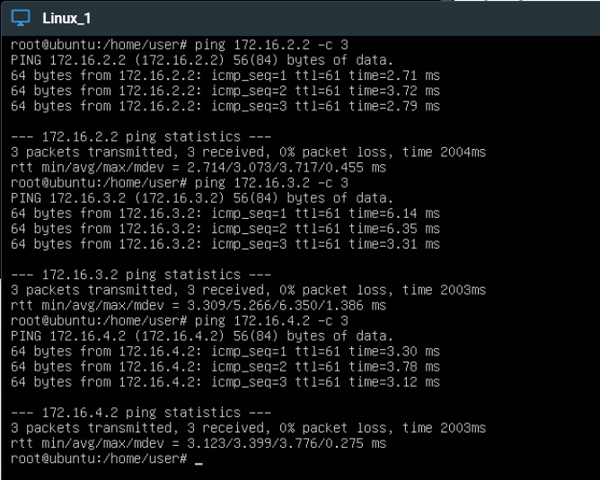

#### Пинги IPv6 от клиента Linux_1

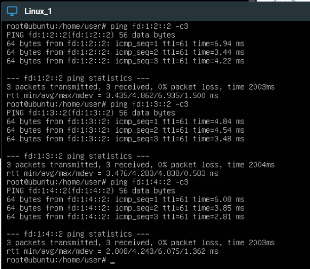

---

#### Маршруты IPv4 L01

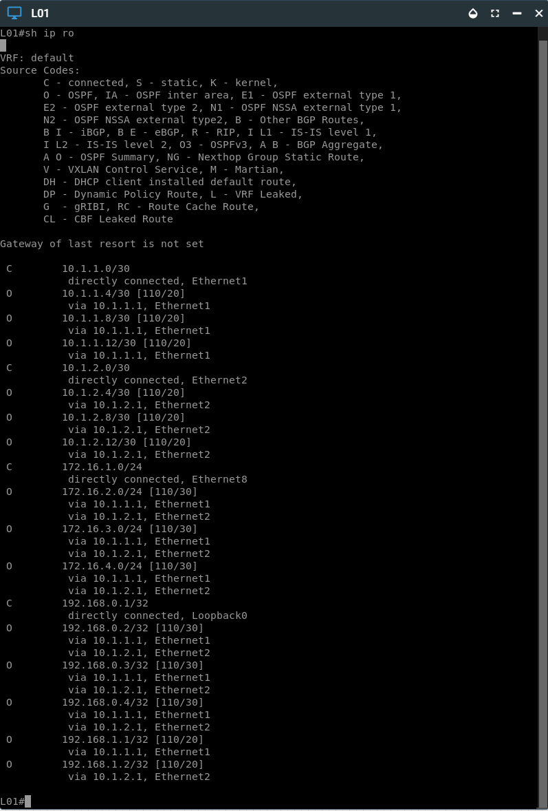

#### Маршруты IPv6 L01

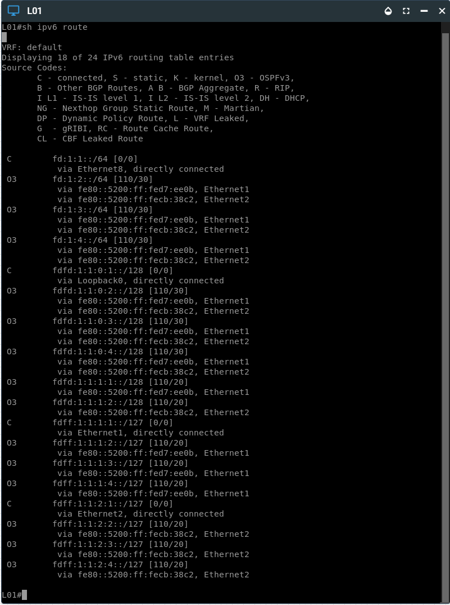

---

#### Маршруты IPv4 L02

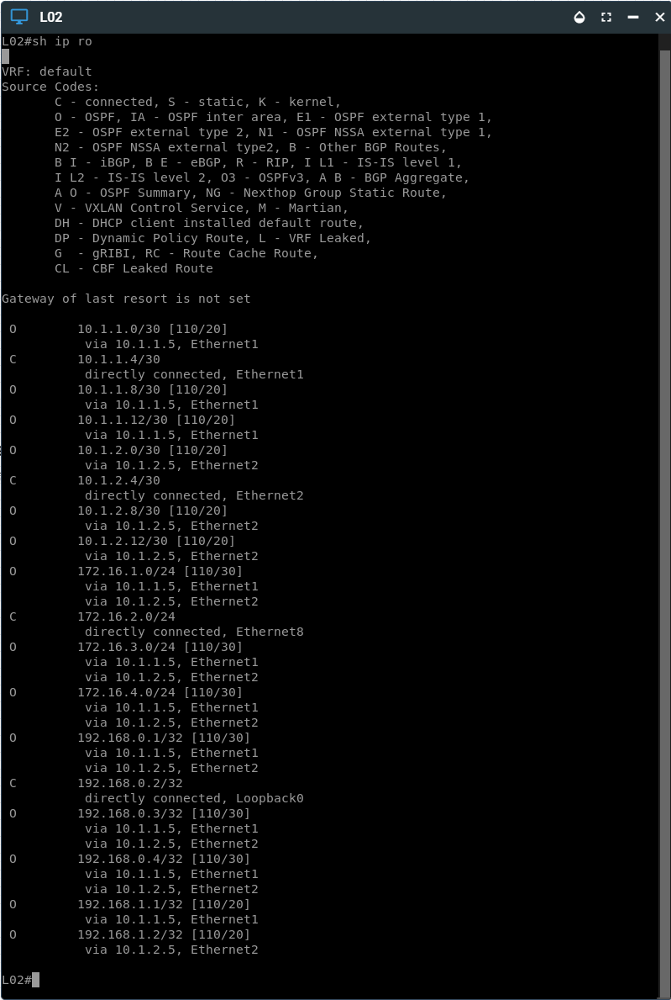

#### Маршруты IPv6 L02

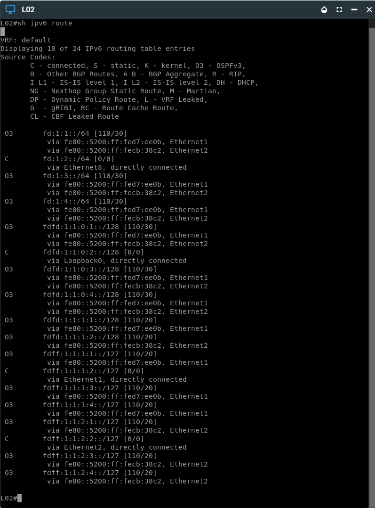

---

#### Маршруты IPv4 L03

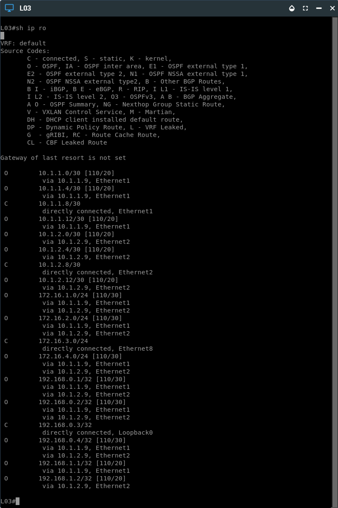

#### Маршруты IPv6 L03

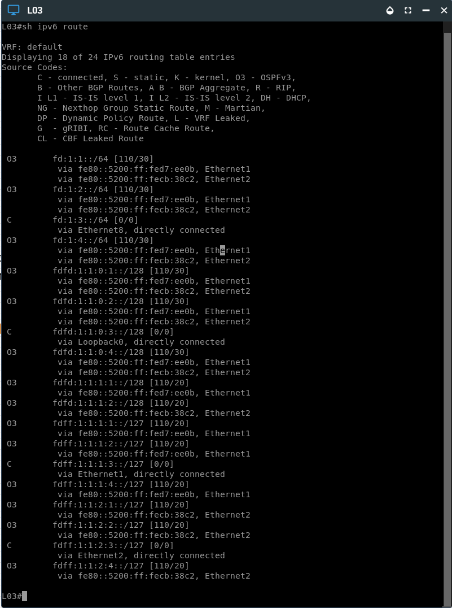

---

#### Маршруты IPv4 L04

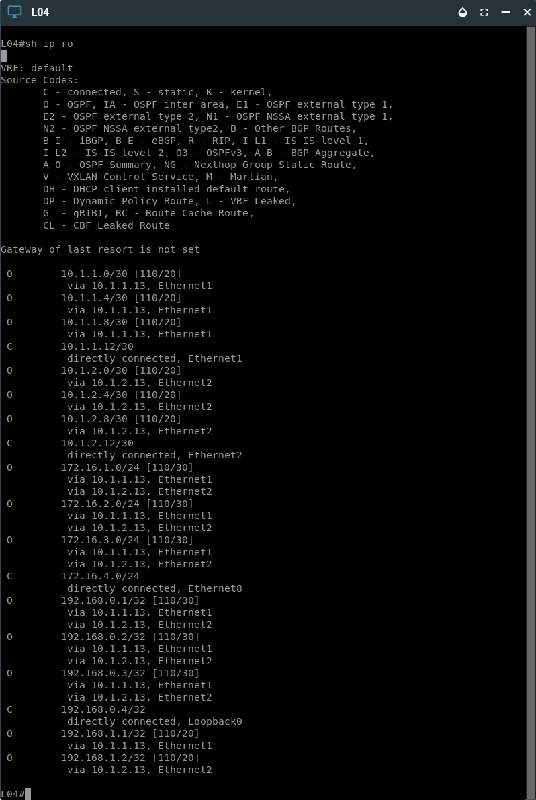

#### Маршруты IPv6 L04


---

#### Маршруты IPv4 L04


#### Маршруты IPv6 L04


---

#### BFD‑соседство S01

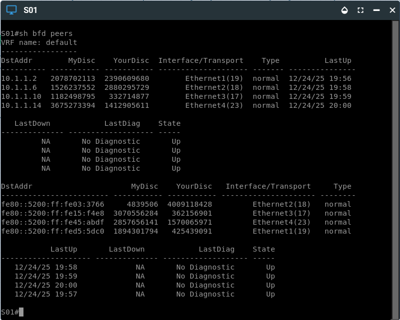

#### BFD‑соседство S02

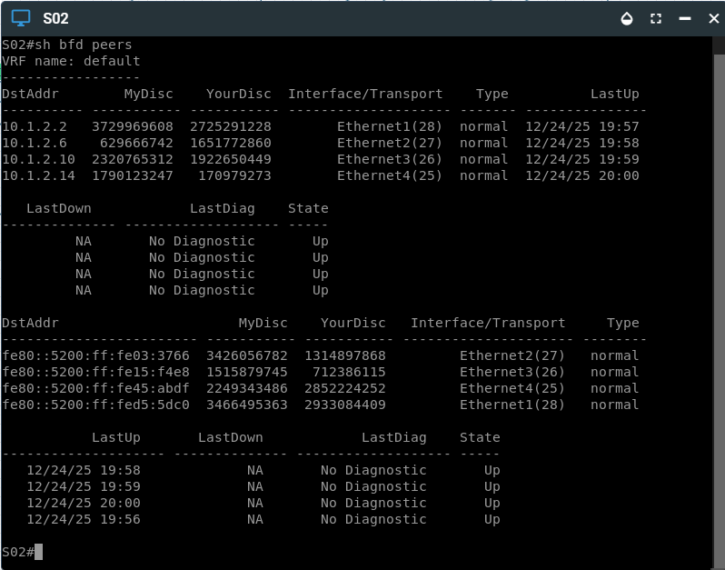

---

### [Файлы конфигураций устройств](./conf/)
