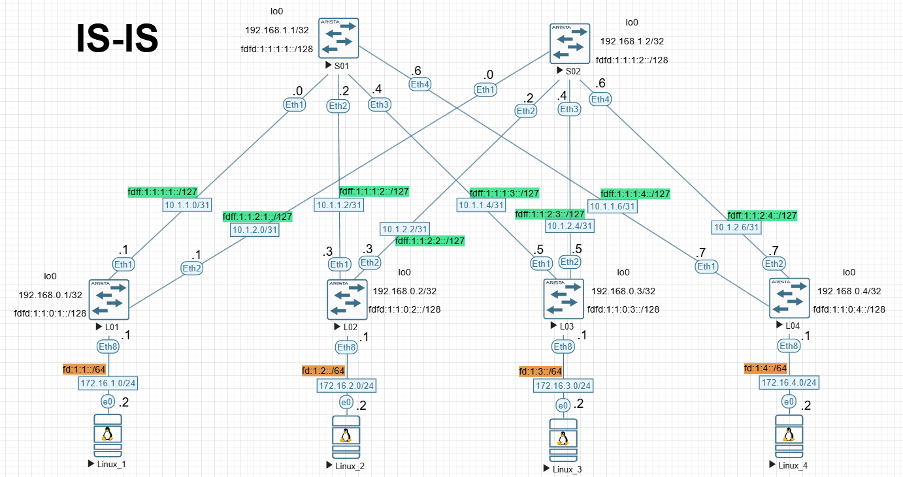

# Лабораторная №3

## Underlay. IS-IS

### Цель задания

Настроить IS-IS для Underlay сети.

### Задачи

1. Настроите ISIS в Underlay сети, для IP связанности между всеми сетевыми устройствами.
2. Зафиксируете в документации - план работы, адресное пространство, схему сети, конфигурацию устройств
3. Убедитесь в наличии IP связанности между устройствами в ISIS домене

### Топология сети



---

### Схема адресов IPv4 & IPv6

> **Примечание:** В текущей работе изменена адресация на линках Spine-Leaf с сетевой маски /30 на маску /31.

План адресов IPv4 для линков Spline-Leaf составлен по схеме `10.a.b.c/31`, где

- a - номер DC/POD,
- b - номер Spine,
- c - по очереди для подсети /31.

Адреса loopback `192.168.x.y/32`, где

- z - 1 для Spine, 0 - для Leaf,
- y - номер spine или leaf по порядку

Адреса для клиентов - `172.16.x.y/24`, где

- x - номер Leaf,
- y - порядковый адрес хоста. Все Leaf имеют адрес `.1`

---

### Схема адресов IPv6

План адресов IPv6 для линков Spline-Leaf составлен по схеме `fdff:w:x:y:z::/127`, где

- w - номер DC,
- x - номер POD,
- y - номер Spine
- z - номер Leaf

Адреса loopback `fdfd:w:x:y:z::/128`, где

- w - номер DC,
- x - номер POD,
- y - 1 для Spine, 0 - для Leaf,
- z - номер Spine или Leaf по порядку

Адреса для клиентов - `fd:x:y::z/64`, где

- x - номер DC,
- y - номер Leaf
- z - порядковый адрес хоста. Все Leaf имеют адрес `.1`

#### Итоговая таблица адресов Spine & Leaf

| Device | Interface | IP Address       | iPv6 address          |
| ------ | --------- | ---------------- | --------------------- |
| S01    | Lo0       | `192.168.1.1/32` | `fdfd:1:1:1:1::/128`  |
|        | Eth1      | `10.1.1.0/31`    | `fdff:1:1:1:1::/127`  |
|        | Eth2      | `10.1.1.2/31`    | `fdff:1:1:1:2::/127`  |
|        | Eth3      | `10.1.1.4/31`    | `fdff:1:1:1:3::/127`  |
|        | Eth4      | `10.1.1.6/31`    | `fdff:1:1:1:4::/127`  |
| ------ | --------- | --------------   | ------------------    |
| S02    | Lo0       | `192.168.1.2/32` | `fdfd:1:1:1:2::/128`  |
|        | Eth1      | `10.1.2.0/31`    | `fdff:1:1:2:1::/127`  |
|        | Eth2      | `10.1.2.2/31`    | `fdff:1:1:2:2::/127`  |
|        | Eth3      | `10.1.2.4/31`    | `fdff:1:1:2:3::/127`  |
|        | Eth4      | `10.1.2.6/31`    | `fdff:1:1:2:4::/127`  |
| ------ | --------- | --------------   | ------------------    |
| L01    | Lo0       | `192.168.0.1/32` | `fdfd:1:1:0:1::/128`  |
|        | Eth1      | `10.1.1.1/31`    | `fdff:1:1:1:1::1/127` |
|        | Eth2      | `10.1.2.1/31`    | `fdff:1:1:2:1::1/127` |
|        | Eth8      | `172.16.1.1/24`  | `fd:1:1::1/64`        |
| ------ | --------- | --------------   | ------------------    |
| L02    | Lo0       | `192.168.0.2/32` | `fdfd:1:1:0:2::/128`  |
|        | Eth1      | `10.1.1.3/31`    | `fdff:1:1:1:2::1/127` |
|        | Eth2      | `10.1.2.3/31`    | `fdff:1:1:2:2::1/127` |
|        | Eth8      | `172.16.2.1/24`  | `fd:1:2::1/64`        |
| ------ | --------- | --------------   | ------------------    |
| L03    | Lo0       | `192.168.0.3/32` | `fdfd:1:1:0:3::/128`  |
|        | Eth1      | `10.1.1.5/31`    | `fdff:1:1:1:3::1/127` |
|        | Eth2      | `10.1.2.5/31`    | `fdff:1:1:2:3::1/127` |
|        | Eth8      | `172.16.3.1/24`  | `fd:1:3::1/64`        |
| ------ | --------- | --------------   | ------------------    |
| L04    | Lo0       | `192.168.0.4/32` | `fdfd:1:1:0:4::/128`  |
|        | Eth1      | `10.1.1.7/31`    | `fdff:1:1:1:4::1/127` |
|        | Eth2      | `10.1.2.7/31`    | `fdff:1:1:2:4::1/127` |
|        | Eth8      | `172.16.4.1/24`  | `fd:1:4::1/64`        |

#### Итоговая таблица адресов клиентов

| Device  | Interface | IP Address      | Gateway      | IPv6 Address   | IPv6 Gateway |
| ------- | --------- | --------------- | ------------ | -------------- | ------------ |
| Linux_1 | e0        | `172.16.1.2/24` | `172.16.1.1` | `fd:1:1::2/64` | `fd:1:1::1`  |
| Linux_2 | e0        | `172.16.2.2/24` | `172.16.2.1` | `fd:1:2::2/64` | `fd:1:2::1`  |
| Linux_3 | e0        | `172.16.3.2/24` | `172.16.3.1` | `fd:1:3::2/64` | `fd:1:3::1`  |
| Linux_4 | e0        | `172.16.4.2/24` | `172.16.4.1` | `fd:1:4::2/64` | `fd:1:4::1`  |

---

### Схема распределения идентификаторов NET в сети ISIS

Номер сети (NET) составлен по схеме `49.a.b.c.d.00`, где

- a - номер POD,
- c - номер DC,
- c - тип узла, Spine - 1, Leaf - 0
- d - порядковый номер Leaf или Spine

#### Итоговая таблица идентификаторов NET в сети ISIS

| Host | ISIS Net                    |
| ---- | --------------------------- |
| S01  | `49.0001.0001.0001.0001.00` |
| S02  | `49.0001.0001.0001.0002.00` |
| ---- | --------------------------- |
| L01  | `49.0001.0001.0000.0001.00` |
| L02  | `49.0001.0001.0000.0002.00` |
| L03  | `49.0001.0001.0000.0003.00` |
| L04  | `49.0001.0001.0000.0004.00` |

---

### Настройка ISIS на Spine

<details>

<summary>S01</summary>

```
!
interface Ethernet1
   description to_L01
   no switchport
   ip address 10.1.1.0/31
   ipv6 enable
   ipv6 address fdff:1:1:1:1::/127
   isis enable POD1
   isis network point-to-point
   isis authentication mode md5
   isis authentication key 7 7S1kwmc2GMTsI2hzNZxR9w==
!
interface Ethernet2
   description to_L02
   no switchport
   ip address 10.1.1.2/31
   ipv6 enable
   ipv6 address fdff:1:1:1:2::/127
   isis enable POD1
   isis network point-to-point
   isis authentication mode md5
   isis authentication key 7 7S1kwmc2GMTsI2hzNZxR9w==
!
interface Ethernet3
   description to_L03
   no switchport
   ip address 10.1.1.4/31
   ipv6 enable
   ipv6 address fdff:1:1:1:3::/127
   isis enable POD1
   isis network point-to-point
   isis authentication mode md5
   isis authentication key 7 7S1kwmc2GMTsI2hzNZxR9w==
!
interface Ethernet4
   description to_L04
   no switchport
   ip address 10.1.1.6/31
   ipv6 enable
   ipv6 address fdff:1:1:1:4::/127
   isis enable POD1
   isis network point-to-point
   isis authentication mode md5
   isis authentication key 7 7S1kwmc2GMTsI2hzNZxR9w==
!
interface Loopback0
   ip address 192.168.1.1/32
   ipv6 enable
   ipv6 address fdfd:1:1:1:1::/128
   isis enable POD1
   isis passive
!
!
router isis POD1
   net 49.0001.0001.0001.0001.00
   is-hostname S01
   is-type level-1
   authentication mode md5
   authentication key 7 7S1kwmc2GMTsI2hzNZxR9w==
   !
   address-family ipv4 unicast
      bfd all-interfaces
   !
   address-family ipv6 unicast
      bfd all-interfaces
!

```

</details>

<details>

<summary>S02</summary>

```
!
interface Ethernet1
   description to_L01
   no switchport
   ip address 10.1.2.0/31
   ipv6 enable
   ipv6 address fdff:1:1:2:1::/127
   isis enable POD1
   isis network point-to-point
   isis authentication mode md5
   isis authentication key 7 7S1kwmc2GMTsI2hzNZxR9w==
!
interface Ethernet2
   description to_L02
   no switchport
   ip address 10.1.2.2/31
   ipv6 enable
   ipv6 address fdff:1:1:2:2::/127
   isis enable POD1
   isis network point-to-point
   isis authentication mode md5
   isis authentication key 7 7S1kwmc2GMTsI2hzNZxR9w==
!
interface Ethernet3
   description to_L03
   no switchport
   ip address 10.1.2.4/31
   ipv6 enable
   ipv6 address fdff:1:1:2:3::/127
   isis enable POD1
   isis network point-to-point
   isis authentication mode md5
   isis authentication key 7 7S1kwmc2GMTsI2hzNZxR9w==
!
interface Ethernet4
   description to_L04
   no switchport
   ip address 10.1.2.6/31
   ipv6 enable
   ipv6 address fdff:1:1:2:4::/127
   isis enable POD1
   isis network point-to-point
   isis authentication mode md5
   isis authentication key 7 7S1kwmc2GMTsI2hzNZxR9w==
!
interface Loopback0
   ip address 192.168.1.2/32
   ipv6 enable
   ipv6 address fdfd:1:1:1:2::/128
   isis enable POD1
   isis passive
!
router isis POD1
   net 49.0001.0001.0001.0002.00
   is-hostname S02
   is-type level-1
   authentication mode md5
   authentication key 7 7S1kwmc2GMTsI2hzNZxR9w==
   !
   address-family ipv4 unicast
      bfd all-interfaces
   !
   address-family ipv6 unicast
      bfd all-interfaces
!

```

</details>

---

### Настройка ISIS на Leaf

<details>

<summary>L01</summary>

```
!
interface Ethernet1
   description to_S01
   no switchport
   ip address 10.1.1.1/31
   ipv6 enable
   ipv6 address fdff:1:1:1:1::1/127
   isis enable POD1
   isis network point-to-point
   isis authentication mode md5
   isis authentication key 7 7S1kwmc2GMTsI2hzNZxR9w==
!
interface Ethernet2
   description to_S02
   no switchport
   ip address 10.1.2.1/31
   ipv6 enable
   ipv6 address fdff:1:1:2:1::1/127
   isis enable POD1
   isis network point-to-point
   isis authentication mode md5
   isis authentication key 7 7S1kwmc2GMTsI2hzNZxR9w==
!
interface Ethernet8
   no switchport
   ip address 172.16.1.1/24
   ipv6 enable
   ipv6 address fd:1:1::1/64
   isis enable POD1
   isis passive
!
interface Loopback0
   ip address 192.168.0.1/32
   ipv6 enable
   ipv6 address fdfd:1:1:0:1::/128
   isis enable POD1
   isis passive
!
router isis POD1
   net 49.0001.0001.0000.0001.00
   is-hostname L01
   is-type level-1
   authentication mode md5
   authentication key 7 7S1kwmc2GMTsI2hzNZxR9w==
   !
   address-family ipv4 unicast
      bfd all-interfaces
   !
   address-family ipv6 unicast
      bfd all-interfaces
!

```

</details>

<details>

<summary>L02</summary>

```
!
interface Ethernet1
   description to_S01
   no switchport
   ip address 10.1.1.3/31
   ipv6 enable
   ipv6 address fdff:1:1:1:2::1/127
   isis enable POD1
   isis network point-to-point
   isis authentication mode md5
   isis authentication key 7 7S1kwmc2GMTsI2hzNZxR9w==
!
interface Ethernet2
   description to_L02
   no switchport
   ip address 10.1.2.3/31
   ipv6 enable
   ipv6 address fdff:1:1:2:2::1/127
   isis enable POD1
   isis network point-to-point
   isis authentication mode md5
   isis authentication key 7 7S1kwmc2GMTsI2hzNZxR9w==
!
interface Ethernet8
   description to_Linux2
   no switchport
   ip address 172.16.2.1/24
   ipv6 enable
   ipv6 address fd:1:2::1/64
   isis enable POD1
   isis passive
!
interface Loopback0
   ip address 192.168.0.2/32
   ipv6 enable
   ipv6 address fdfd:1:1:0:2::/128
   isis enable POD1
   isis passive
!
router isis POD1
   net 49.0001.0001.0000.0002.00
   is-type level-1
   authentication mode md5
   authentication key 7 7S1kwmc2GMTsI2hzNZxR9w==
   !
   address-family ipv4 unicast
      bfd all-interfaces
   !
   address-family ipv6 unicast
      bfd all-interfaces
!

```

</details>

<details>

<summary>L03</summary>

```
!
interface Ethernet1
   description to_S01
   no switchport
   ip address 10.1.1.5/31
   ipv6 enable
   ipv6 address fdff:1:1:1:3::1/127
   isis enable POD1
   isis network point-to-point
   isis authentication mode md5
   isis authentication key 7 7S1kwmc2GMTsI2hzNZxR9w==
!
interface Ethernet2
   description to_S02
   no switchport
   ip address 10.1.2.5/31
   ipv6 enable
   ipv6 address fdff:1:1:2:3::1/127
   isis enable POD1
   isis network point-to-point
   isis authentication mode md5
   isis authentication key 7 7S1kwmc2GMTsI2hzNZxR9w==
!
interface Ethernet8
   description to_Linux_3
   no switchport
   ip address 172.16.3.1/24
   ipv6 enable
   ipv6 address fd:1:3::1/64
   isis enable POD1
   isis passive
!
interface Loopback0
   ip address 192.168.0.3/32
   ipv6 enable
   ipv6 address fdfd:1:1:0:3::/128
   isis enable POD1
   isis passive
!
router isis POD1
   net 49.0001.0001.0000.0003.00
   is-type level-1
   authentication mode md5
   authentication key 7 7S1kwmc2GMTsI2hzNZxR9w==
   !
   address-family ipv4 unicast
      bfd all-interfaces
   !
   address-family ipv6 unicast
      bfd all-interfaces
!

```

</details>

<details>

<summary>L03</summary>

```
!
interface Ethernet1
   description to_S01
   no switchport
   ip address 10.1.1.7/31
   ipv6 enable
   ipv6 address fdff:1:1:1:4::1/127
   isis enable POD1
   isis network point-to-point
   isis authentication mode md5
   isis authentication key 7 7S1kwmc2GMTsI2hzNZxR9w==
!
interface Ethernet2
   description to_S02
   no switchport
   ip address 10.1.2.7/31
   ipv6 enable
   ipv6 address fdff:1:1:2:4::1/127
   isis enable POD1
   isis network point-to-point
   isis authentication mode md5
   isis authentication key 7 7S1kwmc2GMTsI2hzNZxR9w==
!
interface Ethernet8
   description to_Linux_4
   no switchport
   ip address 172.16.4.1/24
   ipv6 enable
   ipv6 address fd:1:4::1/64
   isis enable POD1
   isis passive
!
interface Loopback0
   ip address 192.168.0.4/32
   ipv6 enable
   ipv6 address fdfd:1:1:0:4::/128
   isis enable POD1
   isis passive
!
router isis POD1
   net 49.0001.0001.0000.0004.00
   is-type level-1
   authentication mode md5
   authentication key 7 7S1kwmc2GMTsI2hzNZxR9w==
   !
   address-family ipv4 unicast
      bfd all-interfaces
   !
   address-family ipv6 unicast
      bfd all-interfaces
!

```

</details>
