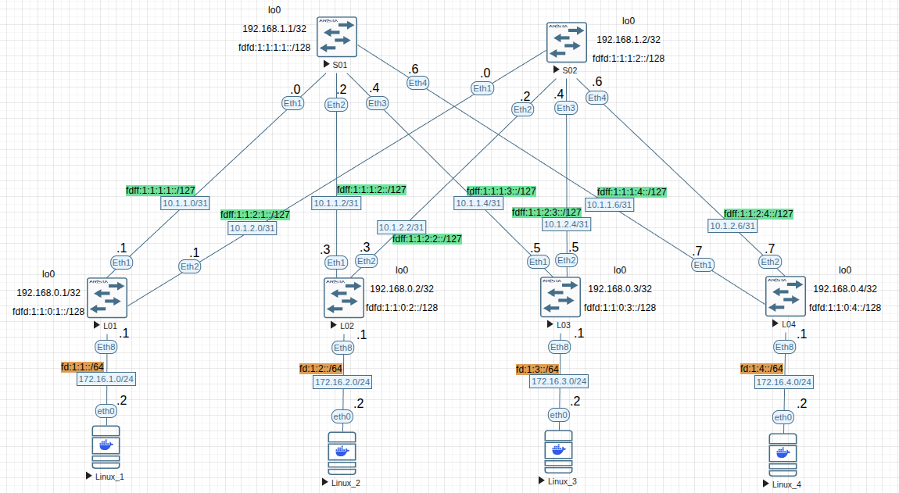
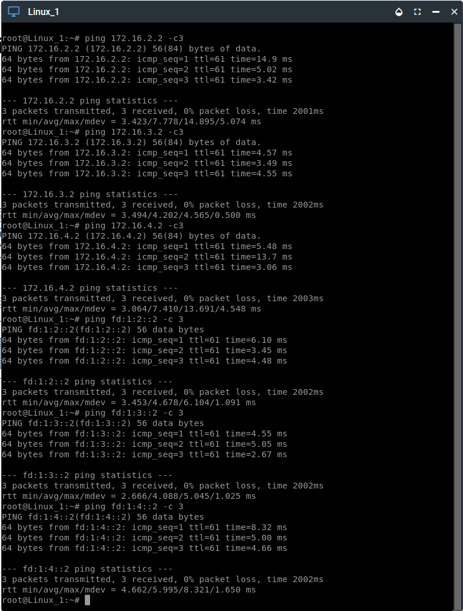
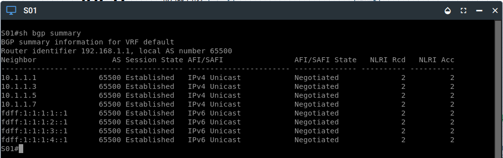
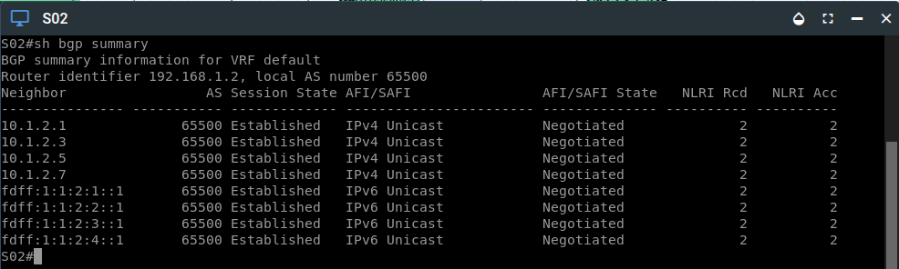
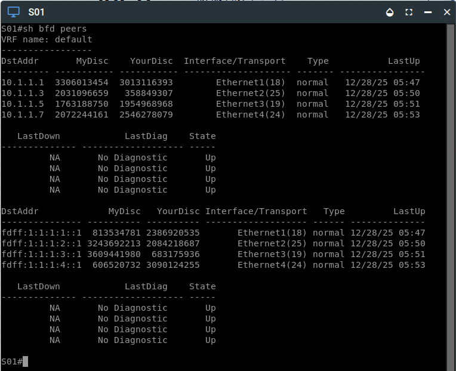

# Лабораторная №4

## Underlay. BGP

### Цель задания

Настроить BGP для Underlay сети.

### Задачи

1. Настроите BGP в Underlay сети, для IP связанности между всеми сетевыми устройствами. iBGP или eBGP - решать вам!
2. Зафиксируете в документации - план работы, адресное пространство, схему сети, конфигурацию устройств
3. Убедитесь в наличии IP связанности между устройствами в BGP домене

### Топология сети



---

### Схема адресов IPv4 & IPv6

> **Примечание:** В текущей работе изменена адресация на линках Spine-Leaf с сетевой маски /30 на маску /31.

лан адресов IPv4 для линков Spline-Leaf составлен по схеме `10.a.b.c/31`, где

- a - номер DC/POD,
- b - номер Spine,
- c - по очереди для подсети /31.

Адреса loopback `192.168.x.y/32`, где

- z - 1 для Spine, 0 - для Leaf,
- y - номер spine или leaf по порядку

Адреса для клиентов - `172.16.x.y/24`, где

- x - номер Leaf,
- y - порядковый адрес хоста. Все Leaf имеют адрес `.1`

---

### Схема адресов IPv6

План адресов IPv6 для линков Spline-Leaf составлен по схеме `fdff:w:x:y:z::/127`, где

- w - номер DC,
- x - номер POD,
- y - номер Spine
- z - номер Leaf

Адреса loopback `fdfd:w:x:y:z::/128`, где

- w - номер DC,
- x - номер POD,
- y - 1 для Spine, 0 - для Leaf,
- z - номер Spine или Leaf по порядку

Адреса для клиентов - `fd:x:y::z/64`, где

- x - номер DC,
- y - номер Leaf
- z - порядковый адрес хоста. Все Leaf имеют адрес `.1`

#### Итоговая таблица адресов Spine & Leaf

| Device | Interface | IP Address       | iPv6 address          |
| ------ | --------- | ---------------- | --------------------- |
| S01    | Lo0       | `192.168.1.1/32` | `fdfd:1:1:1:1::/128`  |
|        | Eth1      | `10.1.1.0/31`    | `fdff:1:1:1:1::/127`  |
|        | Eth2      | `10.1.1.2/31`    | `fdff:1:1:1:2::/127`  |
|        | Eth3      | `10.1.1.4/31`    | `fdff:1:1:1:3::/127`  |
|        | Eth4      | `10.1.1.6/31`    | `fdff:1:1:1:4::/127`  |
| ------ | --------- | --------------   | ------------------    |
| S02    | Lo0       | `192.168.1.2/32` | `fdfd:1:1:1:2::/128`  |
|        | Eth1      | `10.1.2.0/31`    | `fdff:1:1:2:1::/127`  |
|        | Eth2      | `10.1.2.2/31`    | `fdff:1:1:2:2::/127`  |
|        | Eth3      | `10.1.2.4/31`    | `fdff:1:1:2:3::/127`  |
|        | Eth4      | `10.1.2.6/31`    | `fdff:1:1:2:4::/127`  |
| ------ | --------- | --------------   | ------------------    |
| L01    | Lo0       | `192.168.0.1/32` | `fdfd:1:1:0:1::/128`  |
|        | Eth1      | `10.1.1.1/31`    | `fdff:1:1:1:1::1/127` |
|        | Eth2      | `10.1.2.1/31`    | `fdff:1:1:2:1::1/127` |
|        | Eth8      | `172.16.1.1/24`  | `fd:1:1::1/64`        |
| ------ | --------- | --------------   | ------------------    |
| L02    | Lo0       | `192.168.0.2/32` | `fdfd:1:1:0:2::/128`  |
|        | Eth1      | `10.1.1.3/31`    | `fdff:1:1:1:2::1/127` |
|        | Eth2      | `10.1.2.3/31`    | `fdff:1:1:2:2::1/127` |
|        | Eth8      | `172.16.2.1/24`  | `fd:1:2::1/64`        |
| ------ | --------- | --------------   | ------------------    |
| L03    | Lo0       | `192.168.0.3/32` | `fdfd:1:1:0:3::/128`  |
|        | Eth1      | `10.1.1.5/31`    | `fdff:1:1:1:3::1/127` |
|        | Eth2      | `10.1.2.5/31`    | `fdff:1:1:2:3::1/127` |
|        | Eth8      | `172.16.3.1/24`  | `fd:1:3::1/64`        |
| ------ | --------- | --------------   | ------------------    |
| L04    | Lo0       | `192.168.0.4/32` | `fdfd:1:1:0:4::/128`  |
|        | Eth1      | `10.1.1.7/31`    | `fdff:1:1:1:4::1/127` |
|        | Eth2      | `10.1.2.7/31`    | `fdff:1:1:2:4::1/127` |
|        | Eth8      | `172.16.4.1/24`  | `fd:1:4::1/64`        |

#### Итоговая таблица адресов клиентов

| Device  | Interface | IP Address      | Gateway      | IPv6 Address   | IPv6 Gateway |
| ------- | --------- | --------------- | ------------ | -------------- | ------------ |
| Linux_1 | eth0      | `172.16.1.2/24` | `172.16.1.1` | `fd:1:1::2/64` | `fd:1:1::1`  |
| Linux_2 | eth0      | `172.16.2.2/24` | `172.16.2.1` | `fd:1:2::2/64` | `fd:1:2::1`  |
| Linux_3 | eth0      | `172.16.3.2/24` | `172.16.3.1` | `fd:1:3::2/64` | `fd:1:3::1`  |
| Linux_4 | eth0      | `172.16.4.2/24` | `172.16.4.1` | `fd:1:4::2/64` | `fd:1:4::1`  |

---

<details>

<summary><h2>Настройка iBGP для Underlay сети</h2></summary>

### Настройка iBGP на Spine

Для всех Spine и Leaf назначаем номер AS 65500

<details>

<summary>S01</summary>


```
!
interface Ethernet1
   description to_L01
   no switchport
   ip address 10.1.1.0/31
   ipv6 enable
   ipv6 address fdff:1:1:1:1::/127
!
interface Ethernet2
   description to_L02
   no switchport
   ip address 10.1.1.2/31
   ipv6 enable
   ipv6 address fdff:1:1:1:2::/127
!
interface Ethernet3
   description to_L03
   no switchport
   ip address 10.1.1.4/31
   ipv6 enable
   ipv6 address fdff:1:1:1:3::/127
!
interface Ethernet4
   description to_L04
   no switchport
   ip address 10.1.1.6/31
   ipv6 enable
   ipv6 address fdff:1:1:1:4::/127
!
!
interface Loopback0
   ip address 192.168.1.1/32
   ipv6 enable
   ipv6 address fdfd:1:1:1:1::/128
!   
route-map rm_REDISRTIBUTE permit 10
   match interface Loopback0
   set origin igp
!
route-map rm_REDISRTIBUTE deny 50
!
router bgp 65500
   router-id 192.168.1.1
   no bgp default ipv4-unicast
   timers bgp 3 9
   bgp listen range 10.1.0.0/16 peer-group pg_LEAF remote-as 65500
   bgp listen range fdff:1:1::/48 peer-group pg_LEAF_IPv6 remote-as 65500
   neighbor pg_LEAF peer group
   neighbor pg_LEAF next-hop-self
   neighbor pg_LEAF bfd
   neighbor pg_LEAF bfd interval 100 min-rx 100 multiplier 3
   neighbor pg_LEAF route-reflector-client
   neighbor pg_LEAF_IPv6 peer group
   neighbor pg_LEAF_IPv6 next-hop-self
   neighbor pg_LEAF_IPv6 bfd
   neighbor pg_LEAF_IPv6 bfd interval 100 min-rx 100 multiplier 3
   neighbor pg_LEAF_IPv6 route-reflector-client
   redistribute connected route-map rm_REDISRTIBUTE
   !
   address-family ipv4
      neighbor pg_LEAF activate
   !
   address-family ipv6
      neighbor pg_LEAF_IPv6 activate
!
```
</details>

---

<details>

<summary>S02</summary>

```
!
interface Ethernet1
   description to_L01
   no switchport
   ip address 10.1.2.0/31
   ipv6 enable
   ipv6 address fdff:1:1:2:1::/127
!
interface Ethernet2
   description to_L02
   no switchport
   ip address 10.1.2.2/31
   ipv6 enable
   ipv6 address fdff:1:1:2:2::/127
!
interface Ethernet3
   description to_L03
   no switchport
   ip address 10.1.2.4/31
   ipv6 enable
   ipv6 address fdff:1:1:2:3::/127
!
interface Ethernet4
   description to_L04
   no switchport
   ip address 10.1.2.6/31
   ipv6 enable
   ipv6 address fdff:1:1:2:4::/127
!
interface Loopback0
   ip address 192.168.1.2/32
   ipv6 enable
   ipv6 address fdfd:1:1:1:2::/128
!
route-map rm_REDISRTIBUTE permit 10
   match interface Loopback0
   set origin igp
!
route-map rm_REDISRTIBUTE deny 50
!
router bgp 65500
   router-id 192.168.1.2
   no bgp default ipv4-unicast
   timers bgp 3 9
   bgp listen range 10.1.0.0/16 peer-group pg_LEAF remote-as 65500
   bgp listen range fdff:1:1::/48 peer-group pg_LEAF_IPv6 remote-as 65500
   neighbor pg_LEAF peer group
   neighbor pg_LEAF next-hop-self
   neighbor pg_LEAF bfd
   neighbor pg_LEAF bfd interval 100 min-rx 100 multiplier 3
   neighbor pg_LEAF route-reflector-client
   neighbor pg_LEAF_IPv6 peer group
   neighbor pg_LEAF_IPv6 next-hop-self
   neighbor pg_LEAF_IPv6 bfd
   neighbor pg_LEAF_IPv6 bfd interval 100 min-rx 100 multiplier 3
   neighbor pg_LEAF_IPv6 route-reflector-client
   redistribute connected route-map rm_REDISRTIBUTE
   !
   address-family ipv4
      neighbor pg_LEAF activate
   !
   address-family ipv6
      neighbor pg_LEAF_IPv6 activate
!

```

</details>

---

### Настройка iBGP на Leaf

<details>

<summary>L01</summary>

```
!
interface Ethernet1
   description to_S01
   no switchport
   ip address 10.1.1.1/31
   ipv6 enable
   ipv6 address fdff:1:1:1:1::1/127
!
interface Ethernet2
   description to_S02
   no switchport
   ip address 10.1.2.1/31
   ipv6 enable
   ipv6 address fdff:1:1:2:1::1/127
!
interface Ethernet8
   no switchport
   ip address 172.16.1.1/24
   ipv6 enable
   ipv6 address fd:1:1::1/64
!
interface Loopback0
   ip address 192.168.0.1/32
   ipv6 enable
   ipv6 address fdfd:1:1:0:1::/128
!
route-map rm_REDISRTIBUTE permit 10
   match interface Loopback0
   set origin igp
!
route-map rm_REDISRTIBUTE permit 20
   match interface Ethernet8
   set origin igp
!
route-map rm_REDISRTIBUTE deny 50
!
router bgp 65500
   router-id 192.168.0.1
   no bgp default ipv4-unicast
   maximum-paths 2 ecmp 2
   neighbor pg_SPINE peer group
   neighbor pg_SPINE remote-as 65500
   neighbor pg_SPINE bfd
   neighbor pg_SPINE bfd interval 100 min-rx 100 multiplier 3
   neighbor pg_SPINE_IPv6 peer group
   neighbor pg_SPINE_IPv6 remote-as 65500
   neighbor pg_SPINE_IPv6 bfd
   neighbor pg_SPINE_IPv6 bfd interval 100 min-rx 100 multiplier 3
   neighbor 10.1.1.0 peer group pg_SPINE
   neighbor 10.1.2.0 peer group pg_SPINE
   neighbor fdff:1:1:1:1:: peer group pg_SPINE_IPv6
   neighbor fdff:1:1:2:1:: peer group pg_SPINE_IPv6
   redistribute connected route-map rm_REDISRTIBUTE
   !
   address-family ipv4
      neighbor pg_SPINE activate
   !
   address-family ipv6
      neighbor pg_SPINE_IPv6 activate
!

```

</details>

---
<details>

<summary>L02</summary>

```
!
interface Ethernet1
   description to_S01
   no switchport
   ip address 10.1.1.3/31
   ipv6 enable
   ipv6 address fdff:1:1:1:2::1/127
!
interface Ethernet2
   description to_L02
   no switchport
   ip address 10.1.2.3/31
   ipv6 enable
   ipv6 address fdff:1:1:2:2::1/127
!
interface Ethernet8
   description to_Linux2
   no switchport
   ip address 172.16.2.1/24
   ipv6 enable
   ipv6 address fd:1:2::1/64
!
interface Loopback0
   ip address 192.168.0.2/32
   ipv6 enable
   ipv6 address fdfd:1:1:0:2::/128
!
route-map rm_REDISRTIBUTE permit 10
   match interface Loopback0
   set origin igp
!
route-map rm_REDISRTIBUTE permit 20
   match interface Ethernet8
   set origin igp
!
route-map rm_REDISRTIBUTE deny 50
!
router bgp 65500
   router-id 192.168.0.2
   no bgp default ipv4-unicast
   maximum-paths 2 ecmp 2
   neighbor pg_SPINE peer group
   neighbor pg_SPINE remote-as 65500
   neighbor pg_SPINE bfd
   neighbor pg_SPINE bfd interval 100 min-rx 100 multiplier 3
   neighbor pg_SPINE_IPv6 peer group
   neighbor pg_SPINE_IPv6 remote-as 65500
   neighbor pg_SPINE_IPv6 bfd
   neighbor pg_SPINE_IPv6 bfd interval 100 min-rx 100 multiplier 3
   neighbor 10.1.1.2 peer group pg_SPINE
   neighbor 10.1.2.2 peer group pg_SPINE
   neighbor fdff:1:1:1:2:: peer group pg_SPINE_IPv6
   neighbor fdff:1:1:2:2:: peer group pg_SPINE_IPv6
   redistribute connected route-map rm_REDISRTIBUTE
   !
   address-family ipv4
      neighbor pg_SPINE activate
   !
   address-family ipv6
      neighbor pg_SPINE_IPv6 activate
!

```

</details>

---
<details>

<summary>L03</summary>

```
!
interface Ethernet1
   description to_S01
   no switchport
   ip address 10.1.1.5/31
   ipv6 enable
   ipv6 address fdff:1:1:1:3::1/127
!
interface Ethernet2
   description to_S02
   no switchport
   ip address 10.1.2.5/31
   ipv6 enable
   ipv6 address fdff:1:1:2:3::1/127
!
interface Ethernet8
   description to_Linux_3
   no switchport
   ip address 172.16.3.1/24
   ipv6 enable
   ipv6 address fd:1:3::1/64
!
interface Loopback0
   ip address 192.168.0.3/32
   ipv6 enable
   ipv6 address fdfd:1:1:0:3::/128
!
route-map rm_REDISRTIBUTE permit 10
   match interface Loopback0
   set origin igp
!
route-map rm_REDISRTIBUTE permit 20
   match interface Ethernet8
   set origin igp
!
route-map rm_REDISRTIBUTE deny 50
!
router bgp 65500
   router-id 192.168.0.3
   no bgp default ipv4-unicast
   maximum-paths 2 ecmp 2
   neighbor pg_SPINE peer group
   neighbor pg_SPINE remote-as 65500
   neighbor pg_SPINE bfd
   neighbor pg_SPINE bfd interval 100 min-rx 100 multiplier 3
   neighbor pg_SPINE_IPv6 peer group
   neighbor pg_SPINE_IPv6 remote-as 65500
   neighbor pg_SPINE_IPv6 bfd
   neighbor pg_SPINE_IPv6 bfd interval 100 min-rx 100 multiplier 3
   neighbor 10.1.1.4 peer group pg_SPINE
   neighbor 10.1.2.4 peer group pg_SPINE
   neighbor fdff:1:1:1:3:: peer group pg_SPINE_IPv6
   neighbor fdff:1:1:2:3:: peer group pg_SPINE_IPv6
   redistribute connected route-map rm_REDISRTIBUTE
   !
   address-family ipv4
      neighbor pg_SPINE activate
   !
   address-family ipv6
      neighbor pg_SPINE_IPv6 activate
!

```

</details>

---
<details>

<summary>L04</summary>

```
!
interface Ethernet1
   description to_S01
   no switchport
   ip address 10.1.1.7/31
   ipv6 enable
   ipv6 address fdff:1:1:1:4::1/127
!
interface Ethernet2
   description to_S02
   no switchport
   ip address 10.1.2.7/31
   ipv6 enable
   ipv6 address fdff:1:1:2:4::1/127
!
interface Ethernet8
   description to_Linux_4
   no switchport
   ip address 172.16.4.1/24
   ipv6 enable
   ipv6 address fd:1:4::1/64
!
interface Loopback0
   ip address 192.168.0.4/32
   ipv6 enable
   ipv6 address fdfd:1:1:0:4::/128
!
route-map rm_REDISRTIBUTE permit 10
   match interface Loopback0
   set origin igp
!
route-map rm_REDISRTIBUTE permit 20
   match interface Ethernet8
   set origin igp
!
route-map rm_REDISRTIBUTE deny 50
!
router bgp 65500
   router-id 192.168.0.4
   no bgp default ipv4-unicast
   maximum-paths 2 ecmp 2
   neighbor pg_SPINE peer group
   neighbor pg_SPINE remote-as 65500
   neighbor pg_SPINE bfd
   neighbor pg_SPINE bfd interval 100 min-rx 100 multiplier 3
   neighbor pg_SPINE_IPv6 peer group
   neighbor pg_SPINE_IPv6 remote-as 65500
   neighbor pg_SPINE_IPv6 bfd
   neighbor pg_SPINE_IPv6 bfd interval 100 min-rx 100 multiplier 3
   neighbor 10.1.1.6 peer group pg_SPINE
   neighbor 10.1.2.6 peer group pg_SPINE
   neighbor fdff:1:1:1:4:: peer group pg_SPINE_IPv6
   neighbor fdff:1:1:2:4:: peer group pg_SPINE_IPv6
   redistribute connected route-map rm_REDISRTIBUTE
   !
   address-family ipv4
      neighbor pg_SPINE activate
   !
   address-family ipv6
      neighbor pg_SPINE_IPv6 activate
!
```

</details>

## Проверка работоспособности iBGP 

<details>

<summary>Пинги от Linux_1 к другим клиентам</summary>



</details>

---

<details>

<summary>BGP соседство</summary>

S01



S02



</details>

---

<details>

<summary>BGP таблица</summary>

L01


L02


L03


L4


</details>

---

<details>

<summary>BFD сосодство</summary>

S01



S02


</details>

---


</details>


<details>

<summary><h2>Настройка eBGP для Underlay сети</h2></summary>

### Настройка eBGP на Spine

Для всех Spine назначаем номер AS 65500

<details>

<summary>S01</summary>

```
!
interface Ethernet1
   description to_L01
   no switchport
   ip address 10.1.1.0/31
   ipv6 enable
   ipv6 address fdff:1:1:1:1::/127
!
interface Ethernet2
   description to_L02
   no switchport
   ip address 10.1.1.2/31
   ipv6 enable
   ipv6 address fdff:1:1:1:2::/127
!
interface Ethernet3
   description to_L03
   no switchport
   ip address 10.1.1.4/31
   ipv6 enable
   ipv6 address fdff:1:1:1:3::/127
!
interface Ethernet4
   description to_L04
   no switchport
   ip address 10.1.1.6/31
   ipv6 enable
   ipv6 address fdff:1:1:1:4::/127
!
interface Loopback0
   ip address 192.168.1.1/32
   ipv6 enable
   ipv6 address fdfd:1:1:1:1::/128
!
route-map rm_REDISTRIBUTE permit 10
   match interface Loopback0
   set origin igp
!
route-map rm_REDISTRIBUTE deny 50
!
peer-filter pf_LEAF
   10 match as-range 65001-65010 result accept
!
router bgp 65500
   router-id 192.168.1.1
   no bgp default ipv4-unicast
   timers bgp 3 9
   bgp listen range 10.1.0.0/16 peer-group pg_LEAF peer-filter pf_LEAF
   bgp listen range fdff:1:1::/48 peer-group pg_LEAF_IPv6 peer-filter pf_LEAF
   neighbor pg_LEAF peer group
   neighbor pg_LEAF bfd
   neighbor pg_LEAF bfd interval 100 min-rx 100 multiplier 3
   neighbor pg_LEAF_IPv6 peer group
   neighbor pg_LEAF_IPv6 bfd
   neighbor pg_LEAF_IPv6 bfd interval 100 min-rx 100 multiplier 3
   redistribute connected route-map rm_REDISTRIBUTE
   !
   address-family ipv4
      neighbor pg_LEAF activate
   !
   address-family ipv6
      neighbor pg_LEAF_IPv6 activate
!

```

</details>

<details>

<summary>S01</summary>

```
!
interface Ethernet1
   description to_L01
   no switchport
   ip address 10.1.2.0/31
   ipv6 enable
   ipv6 address fdff:1:1:2:1::/127
!
interface Ethernet2
   description to_L02
   no switchport
   ip address 10.1.2.2/31
   ipv6 enable
   ipv6 address fdff:1:1:2:2::/127
!
interface Ethernet3
   description to_L03
   no switchport
   ip address 10.1.2.4/31
   ipv6 enable
   ipv6 address fdff:1:1:2:3::/127
!
interface Ethernet4
   description to_L04
   no switchport
   ip address 10.1.2.6/31
   ipv6 enable
   ipv6 address fdff:1:1:2:4::/127
!
interface Loopback0
   ip address 192.168.1.2/32
   ipv6 enable
   ipv6 address fdfd:1:1:1:2::/128
!
route-map rm_REDISTRIBUTE permit 10
   match interface Loopback0
   set origin igp
!
route-map rm_REDISTRIBUTE deny 50
!
peer-filter pf_LEAF
   10 match as-range 65001-65010 result accept
!
router bgp 65500
   router-id 192.168.1.2
   no bgp default ipv4-unicast
   timers bgp 3 9
   bgp listen range 10.1.0.0/16 peer-group pg_LEAF peer-filter pf_LEAF
   bgp listen range fdff:1:1::/48 peer-group pg_LEAF_IPv6 peer-filter pf_LEAF
   neighbor pg_LEAF peer group
   neighbor pg_LEAF bfd
   neighbor pg_LEAF bfd interval 100 min-rx 100 multiplier 3
   neighbor pg_LEAF_IPv6 peer group
   neighbor pg_LEAF_IPv6 bfd
   neighbor pg_LEAF_IPv6 bfd interval 100 min-rx 100 multiplier 3
   redistribute connected route-map rm_REDISTRIBUTE
   !
   address-family ipv4
      neighbor pg_LEAF activate
   !
   address-family ipv6
      neighbor pg_LEAF_IPv6 activate
!

```

</details>
---

### Настройка eBGP на Leaf

<details>

<summary>L01</summary>

```
!
interface Ethernet1
   description to_S01
   no switchport
   ip address 10.1.1.1/31
   ipv6 enable
   ipv6 address fdff:1:1:1:1::1/127
!
interface Ethernet2
   description to_S02
   no switchport
   ip address 10.1.2.1/31
   ipv6 enable
   ipv6 address fdff:1:1:2:1::1/127
!
interface Ethernet8
   no switchport
   ip address 172.16.1.1/24
   ipv6 enable
   ipv6 address fd:1:1::1/64
!
interface Loopback0
   ip address 192.168.0.1/32
   ipv6 enable
   ipv6 address fdfd:1:1:0:1::/128
!
route-map rm_REDISTRIBUTE permit 10
   match interface Loopback0
   set origin igp
!
route-map rm_REDISTRIBUTE permit 20
   match interface Ethernet8
   set origin igp
!
route-map rm_REDISTRIBUTE deny 50
!
router bgp 65001
   router-id 192.168.0.1
   no bgp default ipv4-unicast
   timers bgp 3 9
   maximum-paths 2 ecmp 2
   neighbor pg_SPINE peer group
   neighbor pg_SPINE remote-as 65500
   neighbor pg_SPINE bfd
   neighbor pg_SPINE bfd interval 100 min-rx 100 multiplier 3
   neighbor pg_SPINE_IPv6 peer group
   neighbor pg_SPINE_IPv6 remote-as 65500
   neighbor pg_SPINE_IPv6 bfd
   neighbor pg_SPINE_IPv6 bfd interval 100 min-rx 100 multiplier 3
   neighbor 10.1.1.0 peer group pg_SPINE
   neighbor 10.1.2.0 peer group pg_SPINE
   neighbor fdff:1:1:1:1:: peer group pg_SPINE_IPv6
   neighbor fdff:1:1:2:1:: peer group pg_SPINE_IPv6
   redistribute connected route-map rm_REDISTRIBUTE
   !
   address-family ipv4
      neighbor pg_SPINE activate
   !
   address-family ipv6
      neighbor pg_SPINE_IPv6 activate
!
```
</details>


---
</details>

