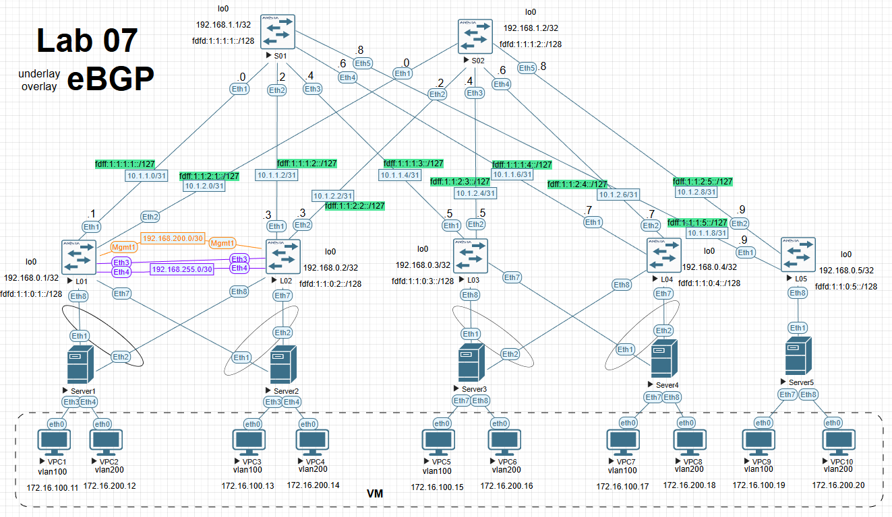

# Лабораторная №7

## VxLAN. Multihoming

### Цель задания

Настроить отказоустойчивое подключение клиентов с использованием EVPN Multihoming.

### Задачи

1. Подключите клиентов 2-я линками к различным Leaf
2. Настроите агрегированный канал со стороны клиента
3. Настроите multihoming для работы в Overlay сети. Если используете Cisco NXOS - vPC, если иной вендор - то ESI LAG (либо MC-LAG с поддержкой VXLAN)
4. Зафиксируете в документации - план работы, адресное пространство, схему сети, конфигурацию устройств
5. Протестировать отказоустойчивость - убедиться, что связнность не теряется при отключении одного из линков

### Топология сети



### Схема адресов IPv4

> **Примечание:** В текущей работе изменена адресация на линках **Spine-Leaf** с сетевой маски /30 на маску /31.

План адресов IPv4 для линков **Spline-Leaf** составлен по схеме `10.a.b.c/31`, где

- a - номер DC/POD,
- b - номер Spine,
- c - по очереди для подсети /31.

Адреса loopback0 `192.168.x.y/32`, где

- x - 1 для Spine, 0 - для Leaf,
- y - номер spine или leaf по порядку

Адреса loopback1 для **MLAG/VTEP** `192.168.100.12/32`

Адреса для клиентов - `172.16.x.y/24`, где

- x - номер VLAN,
- y - порядковый адрес хоста `+10`

Адреса для **SVI** интерфейсов **LEAF** для диагностики - `172.16.x.y/24`, где

- x - номер VLAN,
- y - порядковый адрес хоста

Адресс шлюза по умолчанию `172.16.x.254`, где

- x - номер VLAN,

---

### Схема адресов IPv6

План адресов IPv6 для линков **Spline-Leaf** составлен по схеме `fdff:w:x:y:z::/127`, где

- w - номер DC,
- x - номер POD,
- y - номер Spine
- z - номер Leaf

Адреса loopback `fdfd:w:x:y:z::/128`, где

- w - номер DC,
- x - номер POD,
- y - 1 для Spine, 0 - для Leaf,
- z - номер Spine или Leaf по порядку

Адреса для **SVI** интерфейсов - `fd:x:y::z/64`, где

- x - номер DC,
- y - номер VLAN
- z - порядковый адрес хоста

Адреса для клиентов - самонаначеные **SLAAC**, где

#### Итоговая таблица адресов Spine & Leaf

| Device | Interface | IP Address       | iPv6 address          |
| ------ | --------- | ---------------- | --------------------- |
| S01    | Lo0       | `192.168.1.1/32` | `fdfd:1:1:1:1::/128`  |
|        | Eth1      | `10.1.1.0/31`    | `fdff:1:1:1:1::/127`  |
|        | Eth2      | `10.1.1.2/31`    | `fdff:1:1:1:2::/127`  |
|        | Eth3      | `10.1.1.4/31`    | `fdff:1:1:1:3::/127`  |
|        | Eth4      | `10.1.1.6/31`    | `fdff:1:1:1:4::/127`  |
| ------ | --------- | --------------   | ------------------    |
| S02    | Lo0       | `192.168.1.2/32` | `fdfd:1:1:1:2::/128`  |
|        | Eth1      | `10.1.2.0/31`    | `fdff:1:1:2:1::/127`  |
|        | Eth2      | `10.1.2.2/31`    | `fdff:1:1:2:2::/127`  |
|        | Eth3      | `10.1.2.4/31`    | `fdff:1:1:2:3::/127`  |
|        | Eth4      | `10.1.2.6/31`    | `fdff:1:1:2:4::/127`  |
| ------ | --------- | --------------   | ------------------    |
| L01    | Lo0       | `192.168.0.1/32` | `fdfd:1:1:0:1::/128`  |
|        | Eth1      | `10.1.1.1/31`    | `fdff:1:1:1:1::1/127` |
|        | Eth2      | `10.1.2.1/31`    | `fdff:1:1:2:1::1/127` |
|        | vlan100   | `172.16.100.1`   | `fd:1:100::1/64`      |
|        | vlan200   | `172.16.200.1`   | `fd:1:200::1/64`      |
| ------ | --------- | --------------   | ------------------    |
| L02    | Lo0       | `192.168.0.2/32` | `fdfd:1:1:0:2::/128`  |
|        | Eth1      | `10.1.1.3/31`    | `fdff:1:1:1:2::1/127` |
|        | Eth2      | `10.1.2.3/31`    | `fdff:1:1:2:2::1/127` |
|        | vlan100   | `172.16.100.2`   | `fd:1:100::2/64`      |
|        | vlan200   | `172.16.200.2`   | `fd:1:200::2/64`      |
| ------ | --------- | --------------   | ------------------    |
| L03    | Lo0       | `192.168.0.3/32` | `fdfd:1:1:0:3::/128`  |
|        | Eth1      | `10.1.1.5/31`    | `fdff:1:1:1:3::1/127` |
|        | Eth2      | `10.1.2.5/31`    | `fdff:1:1:2:3::1/127` |
|        | vlan100   | `172.16.100.3`   | `fd:1:100::3/64`      |
|        | vlan200   | `172.16.200.3`   | `fd:1:200::3/64`      |
| ------ | --------- | --------------   | ------------------    |
| L04    | Lo0       | `192.168.0.4/32` | `fdfd:1:1:0:4::/128`  |
|        | Eth1      | `10.1.1.7/31`    | `fdff:1:1:1:4::1/127` |
|        | Eth2      | `10.1.2.7/31`    | `fdff:1:1:2:4::1/127` |
|        | vlan100   | `172.16.100.4`   | `fd:1:100::4/64`      |
|        | vlan200   | `172.16.200.4`   | `fd:1:200::4/64`      |

#### Итоговая таблица адресов клиентов

| Device  | Interface | VLAN  | IP Address         | IP Gateway       | IPv6 Address                        |
| ------- | --------- | ----- | ------------------ | ---------------- | ----------------------------------- |
| VPC1    | eth0      | `100` | `172.16.100.11/24` | `172.16.100.254` | `fd:1:100:0:2050:79ff:fe66:680d/64` |
| VPC2    | eth0      | `200` | `172.16.200.12/24` | `172.16.200.254` | `fd:1:200:0:2050:79ff:fe66:680e/64` |
| VPC3    | eth0      | `100` | `172.16.100.13/24` | `172.16.100.254` | `fd:1:100:0:2050:79ff:fe66:680f/64` |
| VPC4    | eth0      | `200` | `172.16.200.14/24` | `172.16.200.254` | `fd:1:200:0:2050:79ff:fe66:6810/64` |
| VPC5    | eth0      | `100` | `172.16.100.15/24` | `172.16.100.254` | `fd:1:100:0:2050:79ff:fe66:6809/64` |
| VPC6    | eth0      | `200` | `172.16.200.16/24` | `172.16.200.254` | `fd:1:200:0:2050:79ff:fe66:6813/64` |
| VPC7    | eth0      | `100` | `172.16.100.17/24` | `172.16.100.254` | `fd:1:100:0:2050:79ff:fe66:6811/64` |
| VPC8    | eth0      | `200` | `172.16.200.18/24` | `172.16.200.254` | `fd:1:200:0:2050:79ff:fe66:6812/64` |
| VPC9    | eth0      | `100` | `172.16.100.17/24` | `172.16.100.254` | `fd:1:100:0:2050:79ff:fe66:6815/64` |
| VPC10   | eth0      | `200` | `172.16.200.18/24` | `172.16.200.254` | `fd:1:200:0:2050:79ff:fe66:6816/64` |

---

<details>

<summary><h2>Настройка <b>MLAG</b> пары на <b>LEAF</b> L01 и L02</h2></summary>

### L01

```
vlan 4090
   name MLAG-peerlink
   trunk group MLAG-peerlink
!
vrf instance MGMT
!
interface Port-Channel34
   description MLAG-PEERLINK
   switchport mode trunk
   switchport trunk group MLAG-peerlink
   spanning-tree link-type point-to-point
!
interface Ethernet3
   description MLAG-PEERLINK
   channel-group 34 mode active
!
interface Ethernet4
   description MLAG-PEERLINK
   channel-group 34 mode active
!
interface Management1
   vrf MGMT
   ip address 192.168.200.1/30
!
interface Vlan4090
   ip address 192.168.255.1/30
!
ip routing vrf MGMT
!
mlag configuration
   domain-id Leaves-01-02
   local-interface Vlan4090
   peer-address 192.168.255.2
   peer-address heartbeat 192.168.200.2 vrf MGMT
   peer-link Port-Channel34
   dual-primary detection delay 1 action errdisable all-interfaces
!

```

### L02

```
vlan 4090
   name MLAG-peerlink
   trunk group MLAG-peerlink
!
vrf instance MGMT
!
interface Port-Channel34
   description MLAG-PEERLINK
   switchport mode trunk
   switchport trunk group MLAG-peerlink
   spanning-tree link-type point-to-point
!
interface Ethernet3
   description MLAG-PEERLINK
   channel-group 34 mode active
!
interface Ethernet4
   description MLAG-PEERLINK
   channel-group 34 mode active
!
interface Management1
   vrf MGMT
   ip address 192.168.200.2/30
!
interface Vlan4090
   ip address 192.168.255.2/30
!
ip routing vrf MGMT
!
mlag configuration
   domain-id Leaves-01-02
   local-interface Vlan4090
   peer-address 192.168.255.2
   peer-address heartbeat 192.168.200.2 vrf MGMT
   peer-link Port-Channel34
   dual-primary detection delay 1 action errdisable all-interfaces
!

```

</details>
