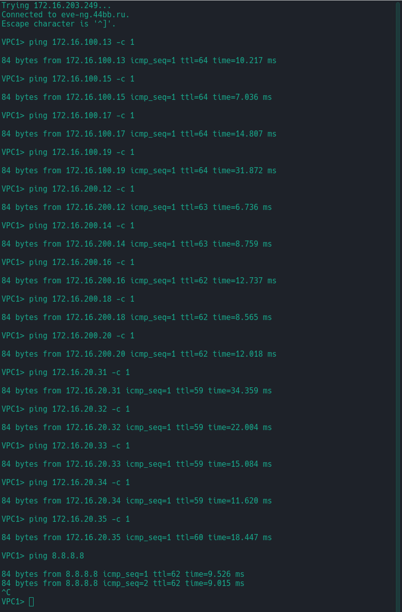
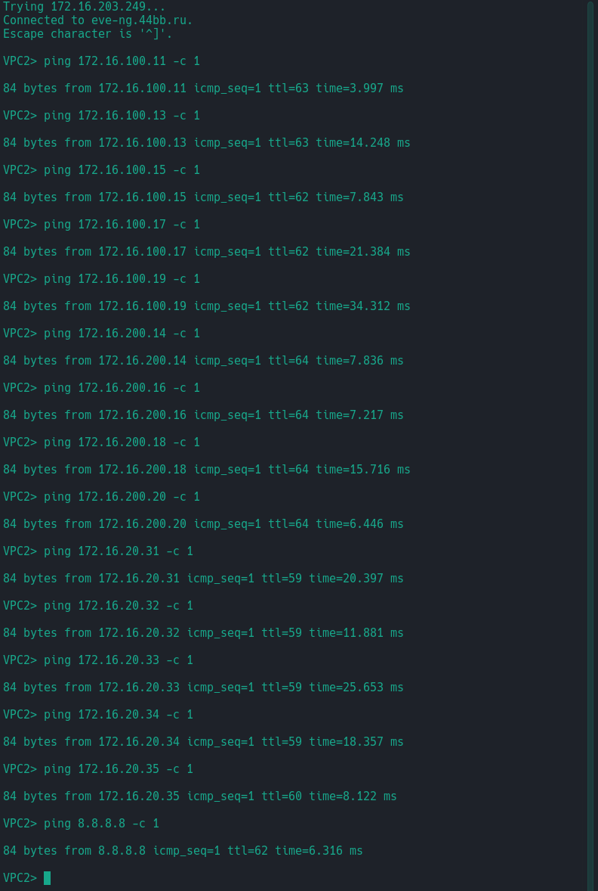
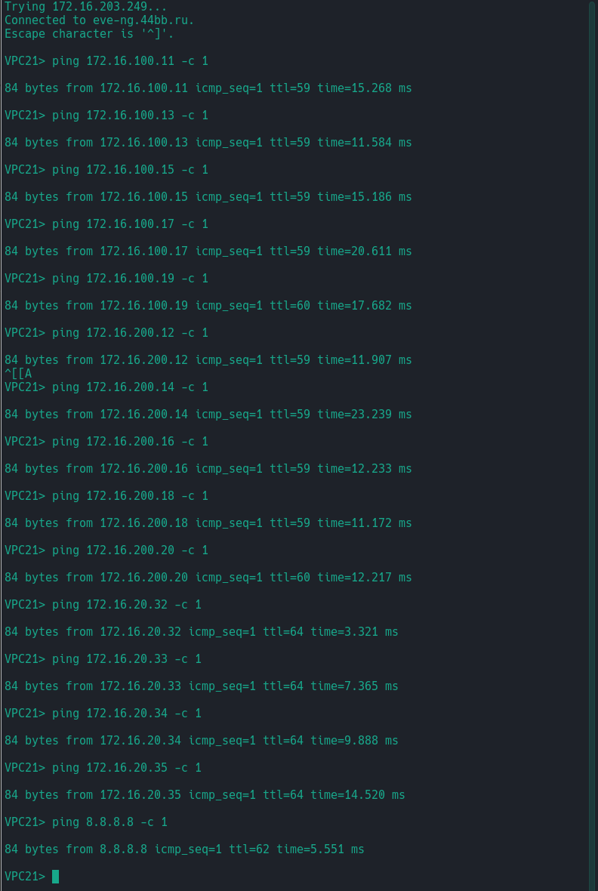

# Лабораторная №7

## VxLAN. Routing.

### Цель задания

НРеализовать передачу суммарных префиксов через EVPN route-type 5.

### Задачи

1. Разместите двух "клиентов" в разных VRF в рамках одной фабрики.
2. Настроите маршрутизацию между клиентами через внешнее устройство (граничный роутер\фаерволл\etc)
3. Зафиксируете в документации - план работы, адресное пространство, схему сети, конфигурацию устройств


### Топология сети


---

### Схема адресов IPv4

> **Примечание:** В текущей работе изменена адресация на линках **Spine-Leaf** с сетевой маски /30 на маску /31.

План адресов IPv4 для линков **Spline-Leaf** составлен по схеме `10.a.b.c/31`, где

- a - номер DC/POD,
- b - номер Spine,
- c - по очереди для подсети /31.

Адреса loopback0 `192.168.x.y/32`, где

- x - 1 для Spine, 0 - для Leaf,
- y - номер spine или leaf по порядку

Адреса loopback1 для **MLAG/VTEP** `192.168.100.12/32`

Адреса для клиентов - `172.16.x.y/24`, где

- x - номер VLAN,
- y - порядковый адрес хоста `+10`

Адреса для **SVI** интерфейсов **LEAF** для диагностики - `172.16.x.y/24`, где

- x - номер VLAN,
- y - порядковый адрес хоста

Адресс шлюза по умолчанию `172.16.x.254`, где

- x - номер VLAN,

---

### Схема адресов IPv6

План адресов IPv6 для линков **Spline-Leaf** составлен по схеме `fdff:w:x:y:z::/127`, где

- w - номер DC,
- x - номер POD,
- y - номер Spine
- z - номер Leaf

Адреса loopback `fdfd:w:x:y:z::/128`, где

- w - номер DC,
- x - номер POD,
- y - 1 для Spine, 0 - для Leaf,
- z - номер Spine или Leaf по порядку

Адреса для **SVI** интерфейсов - `fd:x:y::z/64`, где

- x - номер DC,
- y - номер VLAN
- z - порядковый адрес хоста

Адреса для клиентов - самонаначеные **SLAAC**, где

#### Итоговая таблица адресов Spine & Leaf

| Device | Interface | VRF  | IP Address          | iPv6 address             |
| ------ | --------- | ---- | ------------------- | ------------------------ |
| S01    | Lo0       |      | `192.168.1.1/32`    | `fdfd:1:1:1:1::/128`     |
|        | Eth1      |      | `10.1.1.0/31`       | `fdff:1:1:1:1::/127`     |
|        | Eth2      |      | `10.1.1.2/31`       | `fdff:1:1:1:2::/127`     |
|        | Eth3      |      | `10.1.1.4/31`       | `fdff:1:1:1:3::/127`     |
|        | Eth4      |      | `10.1.1.6/31`       | `fdff:1:1:1:4::/127`     |
| ------ | --------- | ---  | ------------------- | ------------------------ |
| S02    | Lo0       |      | `192.168.1.2/32`    | `fdfd:1:1:1:2::/128`     |
|        | Eth1      |      | `10.1.2.0/31`       | `fdff:1:1:2:1::/127`     |
|        | Eth2      |      | `10.1.2.2/31`       | `fdff:1:1:2:2::/127`     |
|        | Eth3      |      | `10.1.2.4/31`       | `fdff:1:1:2:3::/127`     |
|        | Eth4      |      | `10.1.2.6/31`       | `fdff:1:1:2:4::/127`     |
| ------ | --------- | ---  | ------------------- | ------------------------ |
| L01    | Lo0       |      | `192.168.0.1/32`    | `fdfd:1:1:0:1::/128`     |
|        | Lo1       |      | `192.168.100.12/32` |                          |
|        | Eth1      |      | `10.1.1.1/31`       | `fdff:1:1:1:1::1/127`    |
|        | Eth2      |      | `10.1.2.1/31`       | `fdff:1:1:2:1::1/127`    |
|        | vlan100   |      | `172.16.100.1/24`   | `fd:1:100::1/64`         |
|        | vlan200   |      | `172.16.200.1/24`   | `fd:1:200::1/64`         |
| ------ | --------- | ---  | ------------------- | ------------------------ |
| L02    | Lo0       |      | `192.168.0.2/32`    | `fdfd:1:1:0:2::/128`     |
|        | Lo1       |      | `192.168.100.12/32` |                          |
|        | Eth1      |      | `10.1.1.3/31`       | `fdff:1:1:1:2::1/127`    |
|        | Eth2      |      | `10.1.2.3/31`       | `fdff:1:1:2:2::1/127`    |
|        | vlan100   | VRF1 | `172.16.100.2/24`   | `fd:1:100::2/64`         |
|        | vlan200   | VRF1 | `172.16.200.2/24`   | `fd:1:200::2/64`         |
|        | vlan20    | VRF2 | `172.16.20.2/24`    | `fd:1:20::2/64`          |
| ------ | --------- | ---  | ------------------- | ------------------------ |
| L03    | Lo0       |      | `192.168.0.3/32`    | `fdfd:1:1:0:3::/128`     |
|        | Eth1      |      | `10.1.1.5/31`       | `fdff:1:1:1:3::1/127`    |
|        | Eth2      |      | `10.1.2.5/31`       | `fdff:1:1:2:3::1/127`    |
|        | vlan100   | VRF1 | `172.16.100.3/24`   | `fd:1:100::3/64`         |
|        | vlan200   | VRF1 | `172.16.200.3/24`   | `fd:1:200::3/64`         |
|        | vlan20    | VRF2 | `172.16.20.3/24`    | `fd:1:20::3/64`          |
| ------ | --------- | ---  | ------------------- | ------------------------ |
| L04    | Lo0       |      | `192.168.0.4/32`    | `fdfd:1:1:0:4::/128`     |
|        | Eth1      |      | `10.1.1.7/31`       | `fdff:1:1:1:4::1/127`    |
|        | Eth2      |      | `10.1.2.7/31`       | `fdff:1:1:2:4::1/127`    |
|        | vlan100   | VRF1 | `172.16.100.4/24`   | `fd:1:100::4/64`         |
|        | vlan200   | VRF1 | `172.16.200.4/24`   | `fd:1:200::4/64`         |
|        | vlan20    | VRF2 | `172.16.20.4/24`    | `fd:1:20::4/64`          |
| ------ | --------- | ---  | ------------------- | ------------------------ |
| L05    | Lo0       |      | `192.168.0.5/32`    | `fdfd:1:1:0:5::/128`     |
|        | Eth1      |      | `10.1.1.9/31`       | `fdff:1:1:1:5::1/127`    |
|        | Eth2      |      | `10.1.2.9/31`       | `fdff:1:1:2:5::1/127`    |
|        | vlan100   | VRF1 | `172.16.100.5/24`   | `fd:1:100::5/64`         |
|        | vlan200   | VRF1 | `172.16.200.5/24`   | `fd:1:200::5/64`         |
|        | vlan20    | VRF2 | `172.16.20.5/24`    | `fd:1:20::5/64`          |
|        | Eth3.901  | VRF1 | `10.255.255.1/31`   | `fdff:10:255:255::1/127` |
|        | Eth3.902  | VRF2 | `10.255.255.3/31`   | `fdff:10:255:255::3/127` |
| ------ | --------- | ---  | ------------------- | ------------------------ |
| R1     | Lo0       |      | `8.8.8.8/32`        | `fd::8:8:8:8/128`        |
|        | Eth3.901  |      | `10.255.255.0/31`   | `fdff:10:255:255::0/127` |
|        | Eth3.902  |      | `10.255.255.2/31`   | `fdff:10:255:255::2/127` |

#### Итоговая таблица адресов клиентов

---

##### VRF1

| Device | Interface | VLAN  | MAC Address         | IP Address         | IP Gateway       | IPv6 Address (SLAAC)                |
| ------ | --------- | ----- | ------------------- | ------------------ | ---------------- | ----------------------------------- |
| VPC1   | eth0      | `100` | `00:50:79:66:68:0d` | `172.16.100.11/24` | `172.16.100.254` | `fd:1:100:0:2050:79ff:fe66:680d/64` |
| VPC2   | eth0      | `200` | `00:50:79:66:68:0e` | `172.16.200.12/24` | `172.16.200.254` | `fd:1:200:0:2050:79ff:fe66:680e/64` |
| VPC3   | eth0      | `100` | `00:50:79:66:68:0f` | `172.16.100.13/24` | `172.16.100.254` | `fd:1:100:0:2050:79ff:fe66:680f/64` |
| VPC4   | eth0      | `200` | `00:50:79:66:68:10` | `172.16.200.14/24` | `172.16.200.254` | `fd:1:200:0:2050:79ff:fe66:6810/64` |
| VPC5   | eth0      | `100` | `00:50:79:66:68:09` | `172.16.100.15/24` | `172.16.100.254` | `fd:1:100:0:2050:79ff:fe66:6809/64` |
| VPC6   | eth0      | `200` | `00:50:79:66:68:13` | `172.16.200.16/24` | `172.16.200.254` | `fd:1:200:0:2050:79ff:fe66:6813/64` |
| VPC7   | eth0      | `100` | `00:50:79:66:68:11` | `172.16.100.17/24` | `172.16.100.254` | `fd:1:100:0:2050:79ff:fe66:6811/64` |
| VPC8   | eth0      | `200` | `00:50:79:66:68:12` | `172.16.200.18/24` | `172.16.200.254` | `fd:1:200:0:2050:79ff:fe66:6812/64` |
| VPC9   | eth0      | `100` | `00:50:79:66:68:15` | `172.16.100.17/24` | `172.16.100.254` | `fd:1:100:0:2050:79ff:fe66:6815/64` |
| VPC10  | eth0      | `200` | `00:50:79:66:68:16` | `172.16.200.18/24` | `172.16.200.254` | `fd:1:200:0:2050:79ff:fe66:6816/64` |

##### VRF2

| Device | Interface | VLAN | MAC Address         | IP Address        | IP Gateway      | IPv6 Address (SLAAC)               |
| ------ | --------- | ---- | ------------------- | ----------------- | --------------- | ---------------------------------- |
| VPC21  | eth0      | `20` | `00:50:79:66:68:17` | `172.16.20.31/24` | `172.16.20.254` | `fd:1:20:0:2050:79ff:fe66:6817/64` |
| VPC22  | eth0      | `20` | `00:50:79:66:68:18` | `172.16.20.32/24` | `172.16.20.254` | `fd:1:20:0:2050:79ff:fe66:6818/64` |
| VPC23  | eth0      | `20` | `00:50:79:66:68:19` | `172.16.20.33/24` | `172.16.20.254` | `fd:1:20:0:2050:79ff:fe66:6819/64` |
| VPC24  | eth0      | `20` | `00:50:79:66:68:1a` | `172.16.20.34/24` | `172.16.20.254` | `fd:1:20:0:2050:79ff:fe66:681a/64` |
| VPC25  | eth0      | `20` | `00:50:79:66:68:1c` | `172.16.20.35/24` | `172.16.20.254` | `fd:1:20:0:2050:79ff:fe66:681c/64` |

---

## Настройка оборудования 

За основу взята лабораторная работа [Lab-07](../lab_07/)

В топологию добавлен дополнительный маршрутизатор **R1** подключенный к **Leaf L05** который выполняет роль *Border Leaf*.

На **Leaf L01-L04** добавляем необходимый *VRF* и *VLAN*.


<details>

<summary>Настройка LEAF L01-L04</summary>

### L01

```
!
vlan 20
   name Client_20
!   
vrf instance VRF1
   description RED_VRF
!
vrf instance VRF2
   description BLUE_VRF
!
interface Vlan20
   vrf VRF2
   ip address 172.16.20.1/24
   ipv6 enable
   ipv6 address fd:1:20::1/64
   ip virtual-router address 172.16.20.254
   ipv6 virtual-router address fd:1:20::ff
!
interface Vxlan1
   vxlan source-interface Loopback1
   vxlan udp-port 4789
   vxlan vlan 20 vni 10020
   vxlan vlan 100 vni 10100
   vxlan vlan 200 vni 10200
   vxlan vrf VRF1 vni 11100
   vxlan vrf VRF2 vni 12100
!
ip routing vrf VRF2
!
ipv6 unicast-routing vrf VRF2
!
router bgp 65001
 !
   vlan 20
      rd auto
      route-target both 65500:10020
      redistribute learned
   vrf VRF2
      rd 65001:12100
      route-target import evpn 65500:12100
      route-target export evpn 65500:12100
      !
      address-family ipv4
         redistribute connected
      !
      address-family ipv6
         redistribute connected
!
```
Полная конфигурация [Leaf L01](./conf/L01.eos)

### L02

```
!
vlan 20
   name Client_20
!
vrf instance VRF1
   description RED_VRF
!
vrf instance VRF2
   description BLUE_VRF
!
interface Vlan20
   vrf VRF2
   ip address 172.16.20.2/24
   ipv6 enable
   ipv6 address fd:1:20::2/64
   ip virtual-router address 172.16.20.254
   ipv6 virtual-router address fd:1:20::ff
!
interface Vxlan1
   vxlan source-interface Loopback1
   vxlan udp-port 4789
   vxlan vlan 20 vni 10020
   vxlan vlan 100 vni 10100
   vxlan vlan 200 vni 10200
   vxlan vrf VRF1 vni 11100
   vxlan vrf VRF2 vni 12100
!
ip routing vrf VRF2
!
ipv6 unicast-routing vrf VRF2
!
router bgp 65001
 !
   vlan 20
      rd auto
      route-target both 65500:10020
      redistribute learned
   vrf VRF2
      rd 65001:12100
      route-target import evpn 65500:12100
      route-target export evpn 65500:12100
      !
      address-family ipv4
         redistribute connected
      !
      address-family ipv6
         redistribute connected
!
```
Полная конфигурация [Leaf L02](./conf/L02.eos)

### L03

```
!
vlan 20
   name Client_20
!
vrf instance VRF1
   description RED_VRF
!
vrf instance VRF2
   description BLUE_VRF
!
interface Vlan20
   vrf VRF2
   ip address 172.16.20.3/24
   ipv6 enable
   ipv6 address fd:1:20::3/64
   ip virtual-router address 172.16.20.254
   ipv6 virtual-router address fd:1:20::ff
!
interface Vxlan1
   vxlan source-interface Loopback0
   vxlan udp-port 4789
   vxlan vlan 20 vni 10020
   vxlan vlan 100 vni 10100
   vxlan vlan 200 vni 10200
   vxlan vrf VRF1 vni 11100
   vxlan vrf VRF2 vni 12100
!
ip routing vrf VRF2
!
ipv6 unicast-routing vrf VRF2
!
router bgp 65003
   !
   vlan 20
      rd auto
      route-target both 65500:10020
      redistribute learned
   !
   vrf VRF2
      rd 65003:12100
      route-target import evpn 65500:12100
      route-target export evpn 65500:12100
      !
      address-family ipv4
         redistribute connected
      !
      address-family ipv6
         redistribute connected
!

```
Полная конфигурация [Leaf L03](./conf/L03.eos)

### L04

```
!
vlan 20
   name Client_20
!
vrf instance VRF1
   description RED_VRF
!
vrf instance VRF2
   description BLUE_VRF
!
interface Vlan20
   vrf VRF2
   ip address 172.16.20.4/24
   ipv6 enable
   ipv6 address fd:1:20::4/64
   ip virtual-router address 172.16.20.254
   ipv6 virtual-router address fd:1:20::ff
!
interface Vxlan1
   vxlan source-interface Loopback0
   vxlan udp-port 4789
   vxlan vlan 20 vni 10020
   vxlan vlan 100 vni 10100
   vxlan vlan 200 vni 10200
   vxlan vrf VRF1 vni 11100
   vxlan vrf VRF2 vni 12100
!
ip routing vrf VRF2
!
ipv6 unicast-routing vrf VRF2
!
router bgp 65004
   !
   vlan 20
      rd auto
      route-target both 65500:10020
      redistribute learned
   !
   vrf VRF2
      rd 65004:12100
      route-target import evpn 65500:12100
      route-target export evpn 65500:12100
      !
      address-family ipv4
         redistribute connected
      !
      address-family ipv6
         redistribute connected
!

```

Полная конфигурация [Leaf L04](./conf/L04.eos)

</details>

---

Основная настройка будет производится на маршрутизаторе **R1** и **BorderLeaf L05**. 

<details>

<summary>Настройка R1 и LEAF L05</summary>

### R1

```
hostname R1
!
interface Ethernet3
   no switchport
!
interface Ethernet3.901
   description RED_VRF1
   encapsulation dot1q vlan 901
   ip address 10.255.255.0/31
   ipv6 enable
   ipv6 address fdff:10:255:255::/127
!
interface Ethernet3.902
   description BLUE_VRF2
   encapsulation dot1q vlan 902
   ip address 10.255.255.2/31
   ipv6 enable
   ipv6 address fdff:10:255:255::2/127
!
interface Loopback0
   ip address 8.8.8.8/32
   ipv6 enable
   ipv6 address fd::8:8:8:8/128
!
ip routing
!
ipv6 unicast-routing
!
ip route 0.0.0.0/0 Null0
!
router bgp 64999
   no bgp default ipv4-unicast
   neighbor 10.255.255.1 remote-as 65005
   neighbor 10.255.255.3 remote-as 65005
   neighbor fdff:10:255:255::1 remote-as 65005
   neighbor fdff:10:255:255::3 remote-as 65005
   !
   address-family ipv4
      neighbor 10.255.255.1 activate
      neighbor 10.255.255.1 default-originate always
      neighbor 10.255.255.3 activate
      neighbor 10.255.255.3 default-originate always
      network 8.8.8.8/32
   !
   address-family ipv6
      neighbor fdff:10:255:255::1 activate
      neighbor fdff:10:255:255::1 default-originate always
      neighbor fdff:10:255:255::3 activate
      neighbor fdff:10:255:255::3 default-originate always
      network fd::8:8:8:8/128
!
end

```

Полная конфигурация [Leaf R1](./conf/R1.eos)

### L05

```
!
vlan 20
   name Client_20
!
vrf instance VRF1
   description RED_VRF
!
vrf instance VRF2
   description BLUE_VRF
!
interface Ethernet3
   no switchport
!
interface Ethernet3.901
   description to_R1
   encapsulation dot1q vlan 901
   vrf VRF1
   ip address 10.255.255.1/31
   ipv6 enable
   ipv6 address fdff:10:255:255::1/127
!
interface Ethernet3.902
   encapsulation dot1q vlan 902
   vrf VRF2
   ip address 10.255.255.3/31
   ipv6 enable
   ipv6 address fdff:10:255:255::3/127
!
interface Vlan20
   vrf VRF2
   ip address 172.16.20.5/24
   ipv6 enable
   ipv6 address fd:1:20::5/64
   ip virtual-router address 172.16.20.254
   ipv6 virtual-router address fd:1:20::ff
!
interface Vxlan1
   vxlan source-interface Loopback0
   vxlan udp-port 4789
   vxlan vlan 20 vni 10020
   vxlan vlan 100 vni 10100
   vxlan vlan 200 vni 10200
   vxlan vrf VRF1 vni 11100
   vxlan vrf VRF2 vni 12100
!
ip routing vrf VRF2
!
ip prefix-list pl_EVPN_HOST
   seq 10 permit 0.0.0.0/0 ge 32
!
ipv6 unicast-routing vrf VRF2
!
route-map rm_EVPN_out deny 10
   match ip address prefix-list pl_EVPN_HOST
!
route-map rm_EVPN_out permit 50
!
router bgp 65005
   !
   vlan 20
      rd auto
      route-target both 65500:10020
      redistribute learned
   !
   !
   vrf VRF1
      rd 65005:11100
      route-target import evpn 65500:11100
      route-target export evpn 65500:11100
      neighbor 10.255.255.0 remote-as 64999
      neighbor 10.255.255.0 update-source Ethernet3.901
      neighbor fdff:10:255:255:: remote-as 64999
      !
      address-family ipv4
         neighbor 10.255.255.0 activate
         neighbor 10.255.255.0 route-map rm_EVPN_out out
         redistribute connected
      !
      address-family ipv6
         neighbor fdff:10:255:255:: activate
         redistribute connected
   !
   vrf VRF2
      rd 65005:12100
      route-target import evpn 65500:12100
      route-target export evpn 65500:12100
      neighbor 10.255.255.2 remote-as 64999
      neighbor fdff:10:255:255::2 remote-as 64999
      !
      address-family ipv4
         neighbor 10.255.255.2 activate
         neighbor 10.255.255.2 route-map rm_EVPN_out out
         redistribute connected
      !
      address-family ipv6
         neighbor fdff:10:255:255::2 activate
         redistribute connected
!


```

Полная конфигурация [Leaf L05](./conf/L05.eos)

</details>

---

**Spine S01&S02** остаются без изменений как и в предыдущих работах.

Полная конфигурация [Spine S01](./conf/S01.eos)

Полная конфигурация [Spine S02](./conf/S02.eos)

---

## Проверка работоспособности сети


<details>

<summary>Пинги IPv4</summary>

### VPC1 vlan100 VRF1



### VPC2 vlan200 VRF1



### VPC21 vlan29 VRF2




</details>