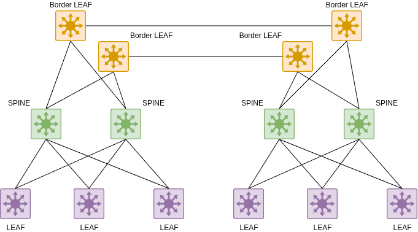
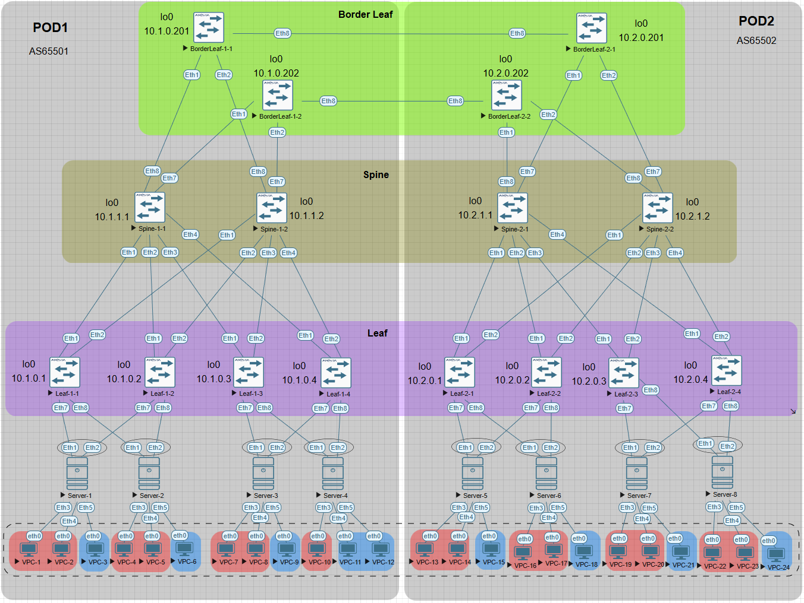
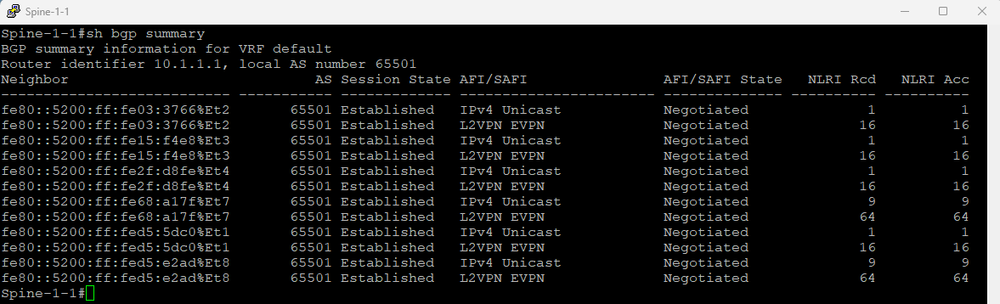
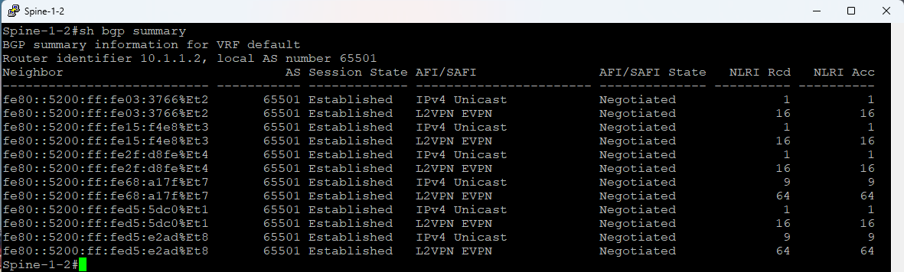
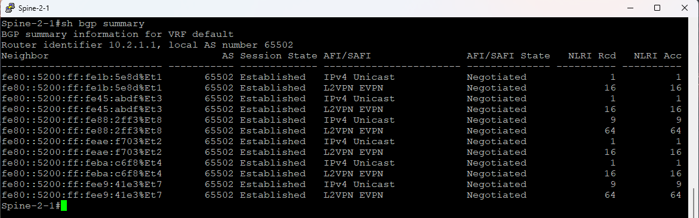
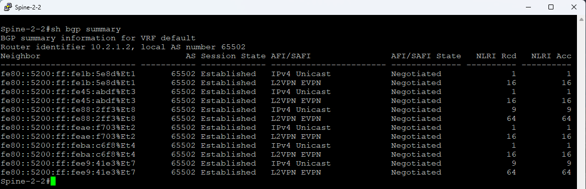
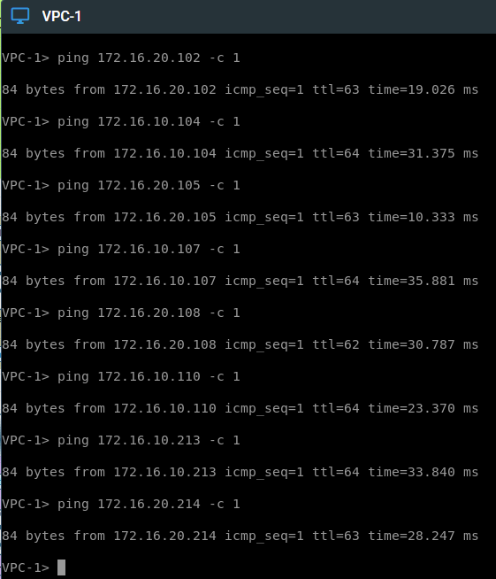
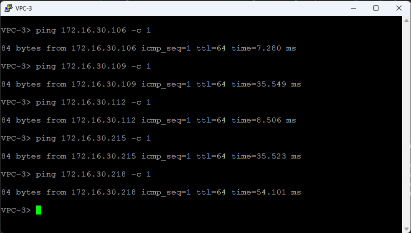

# Проектная работа

# Тема: "Проектирование мультиподовой сети ЦОД на базе технологии EVPN-VXLAN с безадресной IP-фабрикой (IPv6 Unnumbered BGP)"

## Цели:

 - Разработать масштабируемую архитектуру мультиподового ЦОД
 - Реализовать отказоустойчивый underlay с безадресной IPv6 маршрутизацией
 - Обеспечить мультитенантность и изоляцию клиентских сегментов
 - Реализовать мультихоминг (EVPN Ethernet Segment) для серверов
 - Организовать контролируемое межподовое взаимодействие
 - Подтвердить работоспособность и отказоустойчивость спроектированного решения

## Что планировалось (задачи проекта):

 - Разработать топологию Clos-фабрики с двумя подами.
 - Настроить Underlay: BGP unnumbered с использованием IPv6 link-local адресов на всех межкоммутаторных линках.
 - Реализовать Overlay: EVPN с VXLAN инкапсуляцией, распределённый anycast gateway, L2VNI и L3VNI для мультитенантности.
 - Настроить мультихоминг (EVPN Ethernet Segment) для подключения серверов к двум Leaf одновременно.
 - Организовать межподовое взаимодействие через Border Leaf с перезаписью route-target для единой маршрутизации между VRF разных подов.
 - Провести тестирование связности, отказоустойчивости и производительности.

## Используемые технологии

 - Underlay: IPv6 unnumbered, BGP (iBGP) с peer-group, ECMP.
 - Overlay: EVPN (RFC 7432), VXLAN (инкапсуляция), MP-BGP с address-family l2vpn evpn.
 - Мультитенантность: VRF (RED, BLUE), Route Distinguisher, Route Target.
 - Мультихоминг: EVPN Ethernet Segment (ESI), LACP.
 - Межподовое взаимодействие: Option A (VRF-to-VRF) на Border Leaf с перезаписью Route Target через route-map.
 - Платформа: Arista EOS (vEOS-lab).
  

## Архитектура сети (схема)

### Общая топология:

 - Два пода (Pod1: AS 65501, Pod2: AS 65502).
 - Каждый под: 2 Spine, 4 Leaf, 2 Border Leaf.
 - Связь между подами через линки Border Leaf (интерфейсы Ethernet8).
 - Серверы подключены к Leaf через Port-Channel (ESI-LAG).

### Underlay: 
 - Все линки между Leaf, Spine и Border Leaf – L3, с включённым IPv6 (link-local)
 - BGP-сессии устанавливаются через neighbor interface.

### Overlay: 
 
 - VXLAN туннели строятся от Leaf к Leaf, 
 - источник – Loopback0, 
 - Anycast gateway на SVI.

### Общая схема сети


---

## Реализация (что получилось)

### Топология сети


### Underlay сеть

Underlay представляет собой физическую (транспортную) инфраструктуру сети ЦОД, основная задача которой — обеспечить IP-связность между всеми сетевыми устройствами фабрики (Leaf, Spine, Border Leaf) для последующего построения поверхностных (overlay) туннелей VXLAN.

#### Топология Underlay
Сеть построена по архитектуре Clos (leaf-spine):

 - **Два пода (POD1 и POD2)** — каждая фабрика функционирует как независимая автономная система (AS 65501 для POD1, AS 65502 для POD2).
 - **Коммутаторы Spine** (по 2 в каждом поде) — образуют ядро фабрики, соединяя все Leaf-коммутаторы в полносвязную топологию (full mesh).
 - **Коммутаторы Leaf** (по 4 в каждом поде) — к ним подключаются серверы и пограничные маршрутизаторы.
 - **Border Leaf** (по 2 в каждом поде) — специальные Leaf-коммутаторы, отвечающие за взаимодействие между подами.

#### Ключевые особенности Underlay

#### Безадресная IPv6 маршрутизация (IPv6 Unnumbered):

 - На всех L3-линках между коммутаторами (Leaf–Spine, Spine–Border Leaf, Border Leaf–Border Leaf) включён только IPv6 без назначения глобальных IPv4-адресов.
 - Команда `ipv6 enable` генерирует link-local адреса (fe80::/64) на каждом интерфейсе.
 - Глобальная команда `ip routing ipv6 interfaces` разрешает маршрутизацию IPv4-трафика через интерфейсы, имеющие только IPv6-адреса.

#### Протокол маршрутизации BGP:

 - Используется iBGP внутри каждого пода (remote-as совпадает с собственным номером AS).
 - BGP-сессии устанавливаются через IPv6 link-local адреса с помощью конструкции `neighbor interface`, что полностью исключает необходимость назначения IP-адресов на P2P-линки.
 - Применяются `peer-group` (pg_SPINE, pg_LIAF) для унификации настроек и упрощения конфигурации.
 - В address-family IPv4 активированы соседи с опциями:
   - `next-hop address-family ipv6 originate` — следующий хоп передаётся как IPv6-адрес;
   - `next-hop-self` — Leaf анонсирует себя как следующий хоп для достижения клиентских сетей.

#### Loopback-интерфейсы:

Каждое устройство имеет `Loopback0` с адресом /32 (например, 10.1.0.1 для Leaf-1-1, 10.1.1.1 для Spine-1-1).

Loopback-адреса анонсируются в iBGP через `redistribute connected` с использованием `route-map rm_REDISTRIBUTE`, что обеспечивает их доступность по всей фабрике.

Эти адреса служат источником VXLAN-туннелей и идентификаторами BGP-роутеров.

Адреса loopback0 назначены по схеме `10.x.y.z/32`, где

- x - номер POD,
- y - `1` для Spine, `0` - для Leaf
- z - номер spine или leaf по порядку

##### Таблица адресов Loopback интерфейсов POD1

 | Device         | Interface | IP Address      |
 | -------------- | --------- | --------------- |
 | Spine-1-1      | Lo0       | `10.1.1.1/32`   |
 | Spine-1-2      | Lo0       | `10.1.1.2/32`   |
 | Leaf-1-1       | Lo0       | `10.1.0.1/32`   |
 | Leaf-1-2       | Lo0       | `10.1.0.2/32`   |
 | Leaf-1-3       | Lo0       | `10.1.0.3/32`   |
 | Leaf-1-4       | Lo0       | `10.1.0.4/32`   |
 | BorderLeaf-1-1 | Lo0       | `10.1.0.201/32` |
 | BorderLeaf-1-2 | Lo0       | `10.1.0.202/32` |

##### Таблица адресов Loopback интерфейсов POD2

 | Device         | Interface | IP Address      |
 | -------------- | --------- | --------------- |
 | Spine-2-1      | Lo0       | `10.2.1.1/32`   |
 | Spine-2-2      | Lo0       | `10.2.1.2/32`   |
 | Leaf-2-1       | Lo0       | `10.2.0.1/32`   |
 | Leaf-2-2       | Lo0       | `10.2.0.2/32`   |
 | Leaf-2-3       | Lo0       | `10.2.0.3/32`   |
 | Leaf-2-4       | Lo0       | `10.2.0.4/32`   |
 | BorderLeaf-2-1 | Lo0       | `10.2.0.201/32` |
 | BorderLeaf-2-2 | Lo0       | `10.2.0.202/32` |

#### Преимущества реализованного Underlay

- **Упрощение эксплуатации** — единый шаблон конфигурации для всех линков, не требуется индивидуальный IP-план для P2P-соединений.
- **Экономия адресного пространства** — не тратятся ценные IPv4-адреса на транзитные линки.
- **Масштабируемость** — добавление новых Leaf не требует переконфигурации Spine (BGP сам устанавливает соседства по link-local адресам)
- **Отказоустойчивость** — использование ECMP и быстрая сходимость BGP обеспечивают непрерывность связи при отказах.
- **Простота автоматизации** — все Underlay-интерфейсы конфигурируются идентично, что идеально подходит для шаблонов автоматизации (Ansible, CloudVision).

---

### Overlay сеть

Overlay представляет собой логическую сеть, построенную поверх транспортной Underlay-инфраструктуры. Его основная задача — предоставление клиентам (tenant'ам) изолированных **L2** и **L3** сервисов независимо от физической топологии фабрики. В проекте Overlay реализован на базе технологий **EVPN** и **VXLAN**.

#### Архитектурные компоненты Overlay

 - **VXLAN** - VXLAN-туннели строятся между всеми Leaf-коммутаторами фабрики. Источник — Loopback0, UDP порт 4789.
 - **EVPN** - MP-BGP с address-family l2vpn evpn. На Spine — route reflection.
 - **L2VNI** - `VNI 10010` для `VLAN 10`, `VNI 10020` для `VLAN 20`, `VNI 10030` для `VLAN 30`.
 - **L3VNI** - `VNI 200101` для `VRF RED`, `VNI 200102` для `VRF BLUE`.
 - **VRF** - `VRF RED` (клиенты VLAN10 и VLAN20), `VRF BLUE` (клиент VLAN30).
 - **Anycast Gateway** - На каждом Leaf: SVI с одинаковым IP и виртуальным MAC-адресом `02:00:00:00:00:00`.

#### Принцип работы Overlay

##### L2-коммутация через EVPN (Type-2 маршруты)

Когда сервер в VLAN 10 отправляет кадр:
1. Leaf-коммутатор, к которому подключён сервер, изучает MAC-адрес источника.
2. Leaf генерирует **EVPN Type-2** маршрут (MAC/IP advertisement), содержащий:
   - MAC-адрес
   - IP-адрес (если известен)
   - VNI (`10010`)
   - Route Target (`65501:10010`)
3. Маршрут через Spine (`route reflector`) распространяется на все Leaf в фабрике.
4. Другие Leaf импортируют маршрут (по совпадению Route Target) и добавляют MAC-адрес в свою таблицу коммутации с указанием `next-hop` — исходного Leaf (его `Loopback0`).
5. При передаче кадра к этому MAC-адресу Leaf инкапсулирует его в **VXLAN** и отправляет в туннель к целевому Leaf.

#####  L3-маршрутизация между VLAN (Type-5 маршруты)

Когда серверу из `VLAN 10` нужен сервер из `VLAN 20` (оба в `VRF RED`):
1. Трафик направляется на Anycast Gateway (`172.16.10.254`).
2. Leaf, получивший пакет, понимает, что это меж VLAN-трафик.
3. Для маршрутизации используется **L3VNI** (`200101`):
   - Leaf проверяет свою таблицу маршрутизации `VRF RED`.
   - Если целевой Leaf другой, пакет инкапсулируется в **VXLAN** с **L3VNI** и отправляется в туннель.
4. На целевом Leaf декапсуляция, и пакет направляется в нужный `VLAN` через локальный `SVI`.

EVPN Type-5 маршруты анонсируют префиксы клиентских сетей (например, `172.16.10.0/24`) с соответствующим Route Target.

##### Мультихоминг

Для серверов, подключённых к двум Leaf через **ESI-LAG**:

- Оба Leaf анонсируют один и тот же `Ethernet Segment` (с одинаковым ESI).
- **EVPN Type-1** (Ethernet Auto-discovery) маршруты синхронизируют состояние сегмента.
- Для BUM-трафика (broadcast, unknown unicast, multicast) выбирается Designated Forwarder (алгоритм modulus по умолчанию), чтобы избежать дублирования.

#### Ключевые настройки Overlay

##### Интерфейс Vxlan1

```
interface Vxlan1
   vxlan source-interface Loopback0
   vxlan udp-port 4789
   vxlan vlan 10 vni 10010
   vxlan vlan 20 vni 10020
   vxlan vlan 30 vni 10030
   vxlan vrf BLUE vni 200102
   vxlan vrf RED vni 200101
```
##### Anycast Gateway

```
interface Vlan10
   description Client_10
   vrf RED
   ip address 172.16.10.11/24
   ip virtual-router address 172.16.10.254
!
ip virtual-router mac-address 02:00:00:00:00:00
```
##### BGP EVPN на Leaf

```
router bgp 65501
   vlan 10
      rd auto
      route-target both 65501:10010
      redistribute learned
   !
   address-family evpn
      neighbor pg_SPINE activate
      neighbor pg_SPINE next-hop-unchanged
   !
   vrf RED
      rd 10.1.0.1:101
      route-target import evpn 65501:200101
      route-target export evpn 65501:200101
      address-family ipv4
         redistribute connected
```

#### Преимущества реализованного Overlay

 - **Мультитенантность** — полная изоляция клиентских сетей на L2 и L3 уровнях через VRF и разные VNI.
 - **Масштабируемость** — до 16 млн VNI против 4096 VLAN, возможность добавления новых клиентов без изменения физической сети.
 - **Оптимальная маршрутизация** — Anycast Gateway позволяет трафику выходить на ближайший Leaf, избегая "трафика-футбола" (traffic tromboning).
 - **Отказоустойчивость** — при отказе Leaf его функции шлюза мгновенно подхватывают другие Leaf благодаря виртуальному MAC и IP.
 - **Поддержка мультихоминга** — активное-активное подключение серверов с автоматическим переключением при отказах.

---

### Межподовое взаимодействие: 
 
 Межподовое взаимодействие — ключевой компонент проекта, объединяющий две независимые фабрики (POD1 и POD2) в единую логическую сеть. Это позволяет клиентским серверам, расположенным в разных подах, обмениваться трафиком так, как если бы они находились в пределах одной фабрики, сохраняя при этом независимость и изоляцию каждого пода.

#### Архитектурный подход

В проекте реализован подход **Option A (VRF-to-VRF)** на пограничных маршрутизаторах (Border Leaf). Этот метод был выбран по следующим причинам:
 - **Простота** - Border Leaf работают как обычные маршрутизаторы, соединяя VRF разных подов напрямую
 - **Изоляция** - Каждый под сохраняет полную независимость (своя AS, свои протоколы маршрутизации).
 - **Предсказуемость** Чёткое разделение зон ответственности, простой контроль над распространяемыми маршрутами.
 - **Безопасность** Легко фильтровать префиксы и контролировать трафик между подами.

#### Компоненты межподового взаимодействия

##### Пограничные маршрутизаторы (Border Leaf)

В каждом поде выделены по два Border Leaf:
 - POD1: BrdLeaf-1-1 (`10.1.0.201`), BrdLeaf-1-2 (`10.1.0.202`)
 - POD2: BrdLeaf-2-1 (`10.2.0.201`), BrdLeaf-2-2 (`10.2.0.202`)

##### Физическое соединение

 - Интерфейсы `Ethernet8` на всех Border Leaf настроены как L3-порты с IPv6 enable.
 - Каждый Border Leaf POD1 соединяется с обоими Border Leaf POD2 (полносвязная топология).
 - На всех межподовых линках установлен MTU `9000`.

```
interface Ethernet8
   description -=BrdLeaf=-
   mtu 9000
   no switchport
   ipv6 enable
```
##### BGP-соседства между подами

 - Создана отдельная `peer-group pg_BRDLEAF`.
 - Установлено eBGP между Border Leaf разных подов (`remote-as` соседнего пода).
 - Включена отправка extended community (`send-community extended`).

```
router bgp 65501
   neighbor pg_BRDLEAF peer group
   neighbor pg_BRDLEAF remote-as 65502
   neighbor pg_BRDLEAF send-community extended
   neighbor interface Ethernet8 peer-group pg_BRDLEAF
```

#### Управление маршрутной информацией

#####  Проблема несовместимости Route Target

В каждом поде используются свои Route Target для идентификации VNI:

 - POD1: RT `65501:10010`, `65501:10020`, `65501:10030` (L2VNI)
 - POD2: RT `65502:10010`, `65502:10020`, `65502:10030` (L2VNI)
 - Аналогично для L3VNI (`200101`, `200102`)

Если просто передавать маршруты между подами, RT не будут совпадать, и Leaf не смогут импортировать маршруты из соседнего пода.

##### Решение: перезапись Route Target

На всех Border Leaf настроены `extcommunity-list` и `route-map REWRITE_RT_OUT`, выполняющие трансляцию RT при экспорте маршрутов в соседний под.

Пример для BrdLeaf-1-1 (POD1 → POD2)

```
ip extcommunity-list ecl_POD1_10010 permit rt 65501:10010
ip extcommunity-list ecl_POD1_10020 permit rt 65501:10020
ip extcommunity-list ecl_POD1_10030 permit rt 65501:10030
ip extcommunity-list ecl_POD1_200101 permit rt 65501:200101
ip extcommunity-list ecl_POD1_200102 permit rt 65501:200102
!
route-map REWRITE_RT_OUT permit 10
   match extcommunity ecl_POD1_10010
   set extcommunity rt 65502:10010
!
route-map REWRITE_RT_OUT permit 20
   match extcommunity ecl_POD1_10020
   set extcommunity rt 65502:10020
!
route-map REWRITE_RT_OUT permit 30
   match extcommunity ecl_POD1_10030
   set extcommunity rt 65502:10030
!
route-map REWRITE_RT_OUT permit 110
   match extcommunity ecl_POD1_200101
   set extcommunity rt 65502:200101
!
route-map REWRITE_RT_OUT permit 120
   match extcommunity ecl_POD1_200102
   set extcommunity rt 65502:200102
!
route-map REWRITE_RT_OUT permit 200
```

Применение route-map в BGP

```
address-family evpn
   neighbor pg_BRDLEAF activate
   neighbor pg_BRDLEAF route-map REWRITE_RT_OUT out
```

На Border Leaf POD2 настроена аналогичная, но "зеркальная" конфигурация (`65502` → `65501`).

##### Управление next-hop

- При обмене EVPN-маршрутами между подами используется `next-hop-unchanged`.
- Это сохраняет исходный next-hop (Loopback Leaf в исходном поде), что позволяет Leaf в целевом поде строить VXLAN-туннели напрямую к Leaf источника.

```
address-family evpn
   neighbor pg_SPINE next-hop-unchanged
```

#### Преимущества реализованного межподового взаимодействия

 - **Прозрачность для клиентов** — серверы видят друг друга так, будто находятся в одной сети, независимо от физического расположения.
 - **Независимость подов** — каждый под может модернизироваться или расширяться без влияния на другой.
 - **Гранулярный контроль** — route-map позволяют точно управлять, какие маршруты передаются между подами.
 - **Масштабируемость** — добавление новых подов не требует изменения конфигурации существующих (только настройка Border Leaf).
 - **Отказоустойчивость** — наличие двух Border Leaf в каждом поде и полносвязных соединений обеспечивает резервирование межподовых каналов.

### Настронка Серверов и Клиентов

Из-за ограниченности лабораторных ресурсов, функции серверов виртуализации выполняют те же коммутаторы Arista, каждый из которых соединён двумя каналами с парой **Leaf** для имитации мультихоминга.

Функции виртуальных комьютеров выполняют стандартные VPC из EVE-NG.

#### Пример настройки **Server**

```
!
vlan 10
   name Client_10
!
vlan 20
   name Client_20
!
vlan 30
   name Client_30
!
interface Port-Channel12
   switchport mode trunk
!
interface Ethernet1
   switchport mode trunk
   channel-group 12 mode active
!
interface Ethernet2
   switchport mode trunk
   channel-group 12 mode active
!
```

#### Настройка IP адресов киентов 

##### POD1

| VPC   | VRF  | VLAN | IP addresses       |
| ----- | ---- | ---- | ------------------ |
| VPC1  | RED  | 10   | `172.16.10.101/24` |
| VPC2  | RED  | 20   | `172.16.20.102/24` |
| VPC3  | BLUE | 30   | `172.16.30.103/24` |
| VPC4  | RED  | 10   | `172.16.10.104/24` |
| VPC5  | RED  | 20   | `172.16.20.105/24` |
| VPC6  | BLUE | 30   | `172.16.30.106/24` |
| VPC7  | RED  | 10   | `172.16.10.107/24` |
| VPC8  | RED  | 20   | `172.16.20.108/24` |
| VPC9  | BLUE | 30   | `172.16.30.109/24` |
| VPC10 | RED  | 10   | `172.16.10.110/24` |
| VPC11 | BLUE | 30   | `172.16.30.111/24` |
| VPC12 | BLUE | 30   | `172.16.30.112/24` |

##### POD2

| VPC   | VRF  | VLAN | IP addresses       |
| ----- | ---- | ---- | ------------------ |
| VPC13 | RED  | 10   | `172.16.10.213/24` |
| VPC14 | RED  | 20   | `172.16.20.214/24` |
| VPC15 | BLUE | 30   | `172.16.30.215/24` |
| VPC16 | RED  | 10   | `172.16.10.216/24` |
| VPC17 | RED  | 20   | `172.16.20.217/24` |
| VPC18 | BLUE | 30   | `172.16.30.218/24` |
| VPC19 | RED  | 10   | `172.16.10.219/24` |
| VPC20 | RED  | 20   | `172.16.20.220/24` |
| VPC21 | BLUE | 30   | `172.16.30.221/24` |
| VPC22 | RED  | 10   | `172.16.10.222/24` |
| VPC23 | RED  | 20   | `172.16.20.223/24` |
| VPC24 | BLUE | 30   | `172.16.30.224/24` |

  
## Проверка работоспособности

### BGP соседство _Spine-1-1_


### BGP соседство _Spine-1-2_


### BGP соседство _Spine-2-1_


### BGP соседство _Spine-2-2_


### ping в _VFR RED_ от _VPC-1_


### ping в _VFR BLUE_ от _VPC-3_



### Проверка отказоустойчивости _BorderLeaf_

[Chech VPC1](https://github.com/user-attachments/assets/c7e04bdd-a0d0-442b-8023-cf305de03887)

### Проверка отказоустойчивости _Мультихоминг_

[Chech VPC1](https://github.com/user-attachments/assets/74187f27-c2fa-4d1a-95e4-662713eba760)


## Что не получилось 
  
### Заставить корректно работать BFD

При включении протокола Bidirectional Forwarding Detection (BFD) для ускоренного обнаружения отказов на BGP-соседствах в Underlay сети возникли проблемы:

**Симптомы:** после активации BFD хосты (вероятно, виртуальные машины или контейнеры) начинали отключаться или "зависать" в случайном порядке. BGP-сессии начинали флапать.

Вероятные причины в лабораторной среде Eve-NG


### Настроить кооректность работы межподового взаимодействия

При проектировании межподового взаимодействия возникла проблема, связанная с использованием разных Route Target (RT) для L3VNI в каждом поде.

**Исходная ситуация:**
В POD1 использовались RT `65501:200101` и `65501:200102` для L3VNI VRF RED и BLUE соответственно, а в POD2 — `65502:200101` и `65502:200102`.
Для обеспечения связности между подами на Border Leaf была настроена перезапись RT (`route-map REWRITE_RT_OUT`), транслирующая RT при экспорте маршрутов в соседний под.

**Выявленная особенность:**
При такой схеме маршрутизация внутри каждого пода работала в режиме Symmetric IRB (трафик между VLAN внутри одного VRF туннелируется напрямую между Leaf с использованием L3VNI). Однако при передаче трафика между подами фактически применялась модель Asymmetric IRB: трафик от Leaf в POD1 сначала направлялся к Border Leaf, где декапсулировался, маршрутизировался и затем уже в "сыром" виде (или с новой инкапсуляцией) передавался в POD2. Это приводило к неоптимальным путям.

**Возможное решение:**
При использование единых (сквозных) RT для L3VNI во всех подах (RT 65500:200101 и 65500:200102) позволяет установить полноценную симметричную IRB и между подами. В этом случае:

- Leaf каждого пода импортируют маршруты друг друга напрямую, так как RT совпадают.
- VXLAN-туннели строятся непосредственно между Leaf разных подов (через транзитную сеть Border Leaf, но без дополнительной маршрутизации на границе).
- Border Leaf работают только как транзитные узлы для IP-пакетов (Underlay), не участвуя в маршрутизации Overlay.


